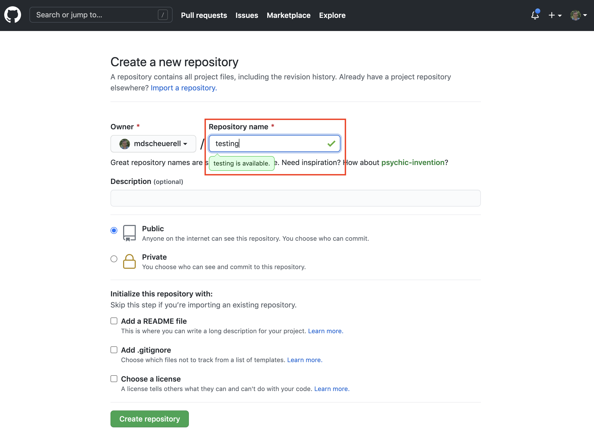
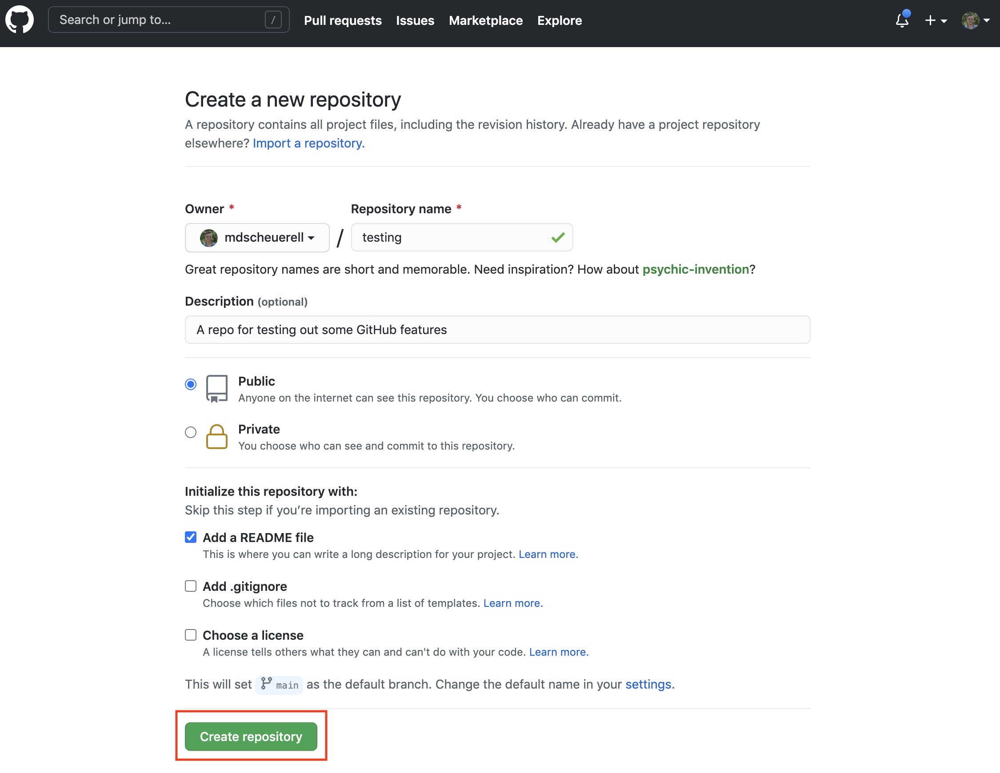
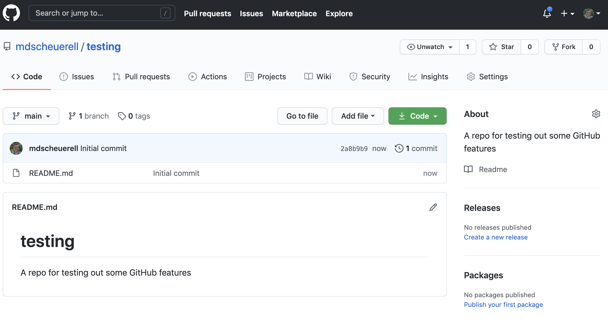

```{r setup, include=FALSE}
knitr::opts_chunk$set(echo = TRUE)
```

# What is GitHub?

GitHub is a code hosting platform for version control and collaboration. It lets you and others work together on projects from anywhere. GitHub itself is not a development tool, but rather a file hosting and collaboration site. In many ways, a social network like Facebook. You can build a profile, create projects to share with others, and follow the accounts of other users. GitHub is not linked to any one programming language like **R**, as you can find all kinds of projects based upon different languages there.

GitHub also runs **Git** in the background. Git is a version control software, which means it records changes to a file or set of files over time so that you can recall specific versions later. We'll learn more about Git in the next session.

# Repositories

A repository (or "repo" for short) is a directory or storage space for your projects on GitHub. Repositories can contain folders and files, images, videos, spreadsheets, and data sets. Most repos include a **README** file, which contains information about your project. GitHub makes it easy to add one at the same time you create your new repository. It also offers other common options such as a license file.

## Create a repository

Creating a repository is quite easy. Follow these steps to do so:

1. Log into your account on GitHub

2. Click on the `+` sign in the upper right and select `New repository`

<br>


<br><br>

3. Give your new repository a name. You can use underscores `_` and hypens `-` as text delimiters if you'd like. For now, call it **testing**.

<br>



<br>

4. Enter some descriptive text in the **Description** field. This can be changed later, so you can keep it simple for now.

<br>


<br>

5. GitHub repos can be set to **Public** or **Private**. If set to public, anyone can browse the contents of your repo. If set to private, only you and those you specify as collaborators can view the contents of the repo. Go ahead and set it to the default **Public**.

<br>


<br>

6. When you create a repo, you have the option of initializing it with a **README** file, a `.gitignore` file, and a license. For now, just check the box next to **Add a README file**.

<br>


<br>

7. When you are finished, click on the green **Create repository** button.

<br>



<br>

8. You now have a new repo that is ready to be populated with folders, code, data sets, etc.

<br>



# Markdown

Markdown is a simple markup language for creating formatted text using a plain-text editor. It makes use of some special characters for formatting headers and text. GitHub automatically recognizes Markdown files with a `.md` extension and renders them as formatted information. The repo we just created has one file in it: `README.md`, and its contents are displayed at the bottom of the repo.

# Issues


# Projects


