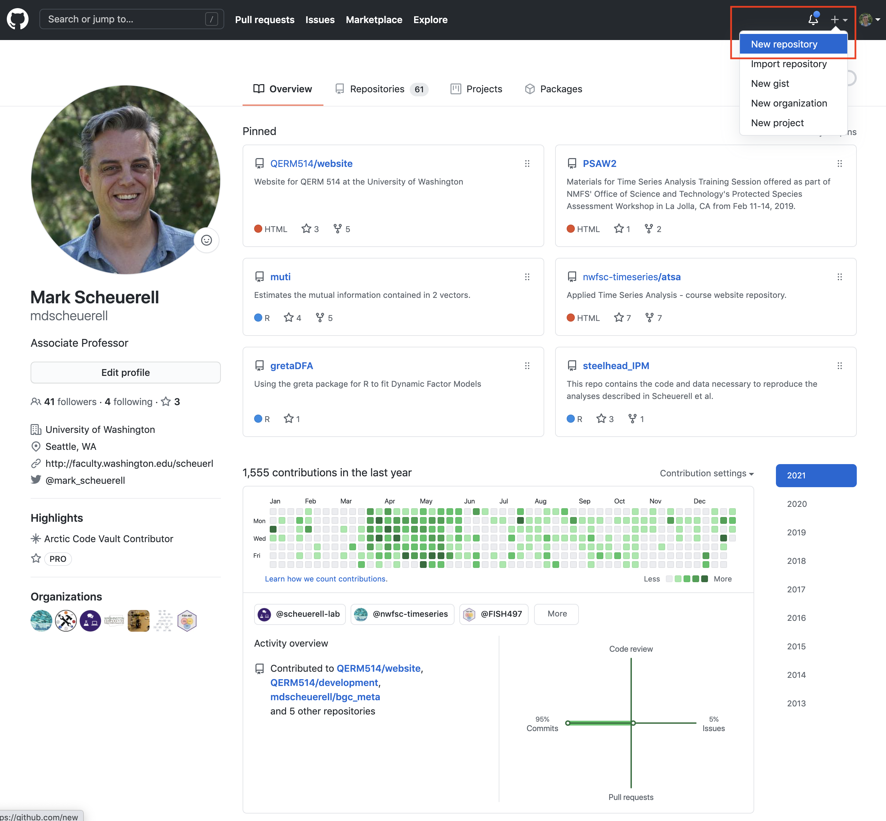
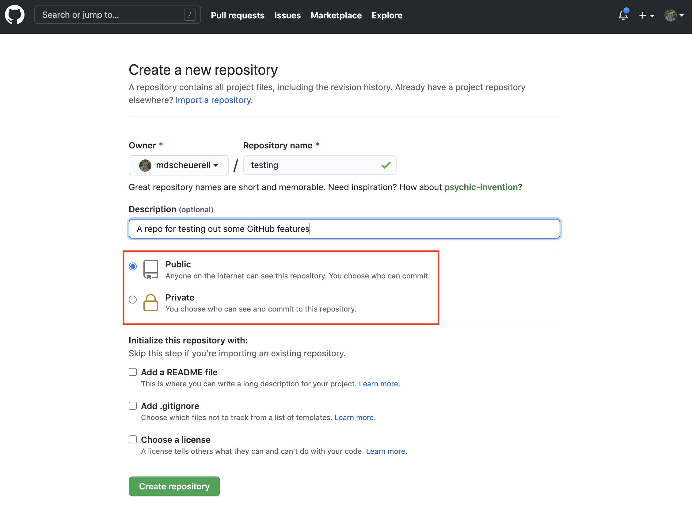
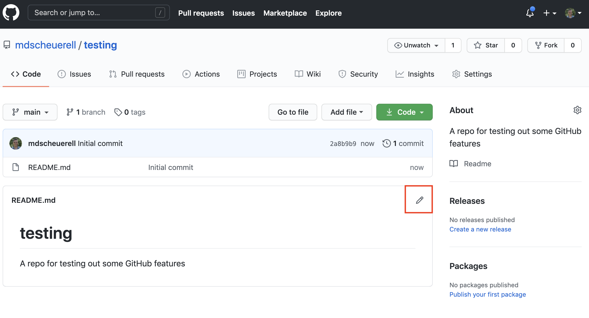

```{r setup, include=FALSE}
knitr::opts_chunk$set(echo = TRUE)
```

# What is GitHub?

GitHub is a code hosting platform for version control and collaboration. It lets you and others work together on projects from anywhere. GitHub itself is not a development tool, but rather a file hosting and collaboration site. In many ways, a social network like Facebook. You can build a profile, create projects to share with others, and follow the accounts of other users. GitHub is not linked to any one programming language like **R**, as you can find all kinds of projects based upon different languages there.

GitHub also runs **Git** in the background. Git is a version control software, which means it records changes to a file or set of files over time so that you can recall specific versions later. We'll learn more about Git in the next session.

***

# Repositories

A repository (or "repo" for short) is a directory or storage space for your projects on GitHub. Repositories can contain folders and files, images, videos, spreadsheets, and data sets. Most repos include a **README** file, which contains information about your project. GitHub makes it easy to add one at the same time you create your new repository. It also offers other common options such as a license file.

## Create a repository

Creating a repository is quite easy. Follow these steps to do so:

1. Log into your account on GitHub

2. Click on the `+` sign in the upper right and select `New repository`

<br>


<br><br>

3. Give your new repository a name. You can use underscores `_` and hypens `-` as text delimiters if you'd like. For now, call it **testing**.

<br>


<br>

4. Enter some descriptive text in the **Description** field. This can be changed later, so you can keep it simple for now.

<br>


<br>

5. GitHub repos can be set to **Public** or **Private**. If set to public, anyone can browse the contents of your repo. If set to private, only you and those you specify as collaborators can view the contents of the repo. Go ahead and set it to the default **Public**.

<br>



<br>

6. When you create a repo, you have the option of initializing it with a `README.md` file, a `.gitignore` file, and a license. For now, just check the box next to **Add a README file**.

<br>


<br>

7. When you are finished, click on the green **Create repository** button.

<br>


<br>

8. You now have a new repo that is ready to be populated with folders, code, data sets, etc.

<br>


***

# Markdown

Markdown is a simple markup language for creating formatted text using a plain-text editor. It makes use of some special characters for formatting headers and text. GitHub automatically recognizes Markdown files with a `.md` extension and renders them as formatted information. The repo we just created has one file in it: `README.md`, and its contents are displayed at the bottom of the repo.

## Writing text

The text in a Markdown document can be formatting in a number of ways. At a basic level, it's just various forms of text that are converted to nicely formatted features when the file is rendered.

### Headings

You can specify different levels of headings using the hash tag (pound) symbol `#`. By adding more `#` signs you can decrease the heading level. So, for example, the following

```
# Heading 1
## Heading 2
### Heading 3
#### Heading 4
```

will render to 

# Heading 1
## Heading 2
### Heading 3
#### Heading 4

### Emphasis

#### Italics

It's easy to add emphasis to text. For *italic* face, wrap the text with either a single asterisk (`*`) or an underscore (`_`). For example,

```
This is *italic*, but then so is _this_.
```

will result in

"This is *italic*, but then so is _this_."

#### Bold

For **bold** face, wrap the text with either two asterisks (`**`) or an underscores (`__`). For example,

```
This is **bold**, but then so is __this__.
```

will render to 

This is **bold**, but then so is __this__.

#### Bold & italic

For combined ***bold and italics*** face, wrap the text with three asterisks (`***`), such that

```
This is ***bold and italic***.
```

renders to

This is ***bold and italic***.

#### Strike-through

If you want to indicate a deletion or ~~strike-through~~, just wrap the text in two tilde's (`~~`), such that

```
Oops, this is ~~a mistake~~.
```

will render to 

Oops, this is ~~a mistake~~.

### Block quotes

You can specify a block quote by preceding it with the `>` symbol, such that

```
> I have a dream that one day this nation will rise up and live out the true meaning of its creed: 'We hold these truths to be self-evident, that all men are created equal.'
```

yields

> I have a dream that one day this nation will rise up and live out the true meaning of its creed: 'We hold these truths to be self-evident, that all men are created equal.'

### Lists

You can include ordered (numbered) lists, unordered (bulleted) lists, or a combination of the two in Markdown documents as well. Numbered lists simply use a number and period (`1.`) followed by a space and the text. For example, this text

```
1. This is item 1  
2. Item 2 comes next
```
     
will render to
     
1. This is item 1  
2. Item 2 comes next

It also turns out that you don't even have to use consecutive numbers to make it work. For example,

```
1. This is item 1  
7. Item 2 comes next
```

will render to

1. This is item 1  
7. Item 2 comes next

You can specify an unordered list with either an asterisk (`*`) or dash (`-`). For example, the following text 

```
* This is a thing 
* Here is another
- And yet another
```

will render to

* This is a thing 
* Here is another
- And yet another

Mixed lists simply use a mixture of the two constructs, such that 

```
1. This is item 1
   * This is a thing
   * Here is another  
2. Item 2 comes next
   - And yet another
```

will render to

1. This is item 1
  * This is a thing
  * Here is another  
2. Item 2 comes next
  - And yet another
  
### Links

You can insert links to websites, other files, and other locations within a file. For websites, there are several options. The first is to simply write out the full address inline (eg, http://www.google.com) and it will parse correctly. You can also use shorthand text to hide the full address or make a sentence more readable. To do that, include the name in square brackets followed by the address inside parentheses For example,

```
Please conduct your search from [this link](http://www.google.com).
```

will render as

Please conduct your search from [this link](http://www.google.com).

### Inserting pictures

#### Inline

Inserting links to images works much the same as for websites, but you add an exclamation point (`!`) at the beginning of the construct (and the text inside the square brackets in optional). For example, here is how to include a hex logo for this class.

```

```

which will yield this


## Displaying R code

One of the truly great features of Markdown is the ability to include code within a document. This course uses **R**, but people also use many other languages in Markdown documents (eg, Python).

### Blocks

The most common method for including code in your document is via code blocks, which can be numerous and separated by text, images, etc. Code blocks are delimited at the beginning and end by three back-ticks (\`\`\`). So, for example, here is a really basic code block

````
`r ''````
a <- 1
b <- 2
```
````

such that above code block would look like

```{r, eval=FALSE}
a <- 1
b <- 2
```

Later in the course when we start using **R Markdown**, you'll see that you can execute the code within a document and display the results.

### Inline

You can also include code snippets within text by surrounding it with backticks (\`). For example,

```
I assigned the the temporary data frame to the variable `tmp`.
```

will result in 

I assigned the the temporary data frame to the variable `tmp`.

<br>

## Edit the README

Let's edit our `README.md` file by clicking on the pencil icon in the upper right.

<br>



<br>

This brings up an editing window where you can add or modify existing text using the various formatting options via Markdown. You can preview a formatted version of your text by clicking the **Preview changes** tab.

<br>


<br>

When you are done editing the text, you need to "commit" the changes. To do so, scroll down to the bottom of the page to the box marked **Commit changes**.

<br>


<br>

This is your first introduction to **Git**. When committing a file, you need to include a "short but informative" commit message to describe the changes you've made. Go ahead and type a commit message in the box and then click the green **Commit changes** button.

<br>


<br>

You will now see your repo with the edited and formatted `README.md` file.

<br>


<br>

***

# Issues

Issues are used to track to-do items, bugs, feature requests, and more. Some people will refer to these as "tickets". Go ahead and click on the **Issues** tab in the upper left near the **Code** tab that you are on now.

<br>


<br>

You will now see a blank slate with a message from GitHub telling you a bit about Issues. Click on the green **New issue** button in the upper right.

<br>


<br>

Now you will see a window for you to enter details about the issue. Go ahead and give your issue an informative title.

<br>


<br>

Most people also include some details concerning a new issue. For example, you might describe a problem you're having or a bug you've encountered that will need to be fixed later. The issue description can also contain formatted text via the same Markdown we used on our `README.md` file. You can also make use of the tool bar to help you with formatting, inserting links, etc.

<br>


<br>

You have some additional options on the righthand side for assigning collaborators to work on an issue, assigning descriptive labels to the issue to help identify its contents, priority, etc. These labels are also searchable from the main Issues page.

<br>


<br>

When you are finished adding a description, labels, etc, click on the green **Submit new issue** button at the bottom.

<br>


<br>

You will now see your new issue as a formatted Markdown document with lots of information about it being "Open", the labels you added, and another comment box at the bottom.

<br>


<br>

Now click on the **Issues** tab in the upper left, which will bring you back to the main Issue page (note that there is now a number "1" inside a circle next to the Issues tab, which means there is one open issue at the moment). From here you can add more issues, or click on existing issues to bring up their details. 

<br>


<br>

***

# Projects

So-called **Projects** in GitHub are a great way to organize your issues, set tasks, track your progress, etc. Click on the **Projects** tab at the top of the page.

<br>


<br>

Here you will see some information about Projects and all of the things you can do with them. Go ahead and click on the green **Create a project** button in the upper right.

<br>


<br>

You will now see a window for creating a new project. Go ahead and give your project an informative title and add a short description as well.

<br>


<br>

One of the nice features about Projects is that you can use templates for their structure. You're welcome to create your own from scratch, but for now lets use one of the built-in templates from GitHub. Click on the pull-down **Template** button on the bottom, which will show you a list of template options. Go ahead and select **Basic kanban**.

<br>


<br>

Lastly, click on the green **Create project** button.

<br>


<br>

You now have a new project to which you can add "cards". By default, GitHub has added 3 cards to the **To do** column on the lefthand side. You will also see an option to **Add cards** on the righthand side, including the new issue we created earlier. This is one of the great features of GitHub. Not only can you create cards from scratch, but you can pull in issues as well to help you manage what's happening, who's doing it, and when it's completed.

You are welcome to follow the tutorial in the first card, but we'll ignore that for now.

<br>


<br>

Let's add the issue we created earlier to this project by clicking and dragging it over to the **To do** column under the existing **Automation** card. After doing so, let's close the **Add cards** window by clicking on the **X** to the right.

<br>


<br>

Let's delete the default cards from our project, as they don't really offer any specific information here. To do so, click on the 3 dots in the upper right of a card and select **Delete note**.

<br>


<br>

Out current project has two columns: **To do** and **In progress**. Let's add another column for completed items and call it **Finished**. To do so, click on the **Add column** button on the right.

<br>


<br>

In the **Coumn name** field, type "Finished" (although the actual name doesn't really matter--you coudl name it "completed" or something else). In the **Automation** section below the column name, click on the Preset button and select "Done". When you are finished, click on the green **Create column** button.

<br>


<br>

You now have a complete Project board with one issue already set to go.

<br>


<br>

When you are ready to work on or resolve an issue, drag it over to the **In progress** column.

<br>


<br>

From here you can click on the name of the issue and the details will appear off to the righthand side. If you want to work on this issue, click on the button in the lower right titled **Go to issue for full details** and GitHub will redirect you to the issues page with that issue open.

<br>


<br>


