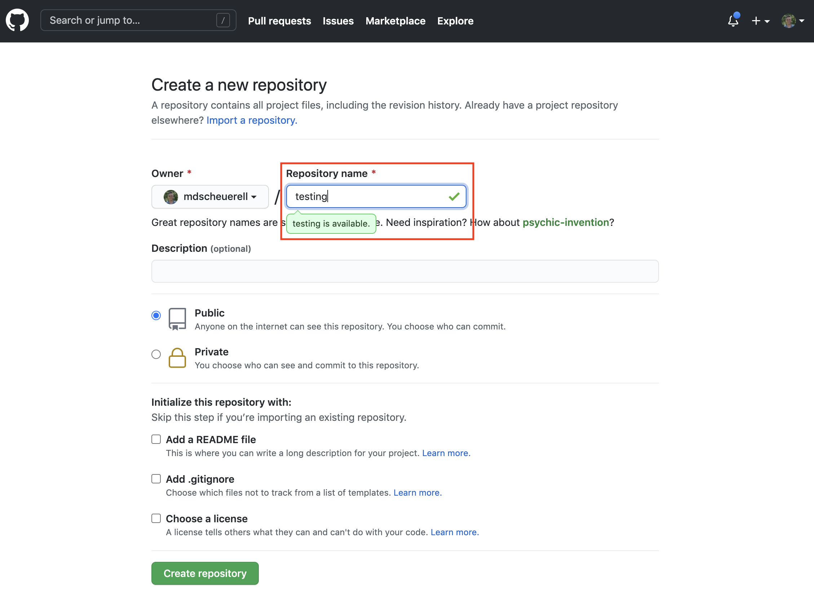
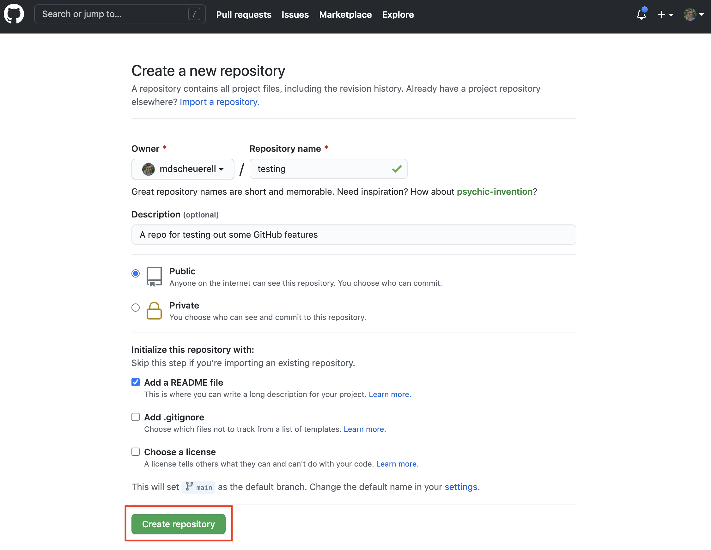
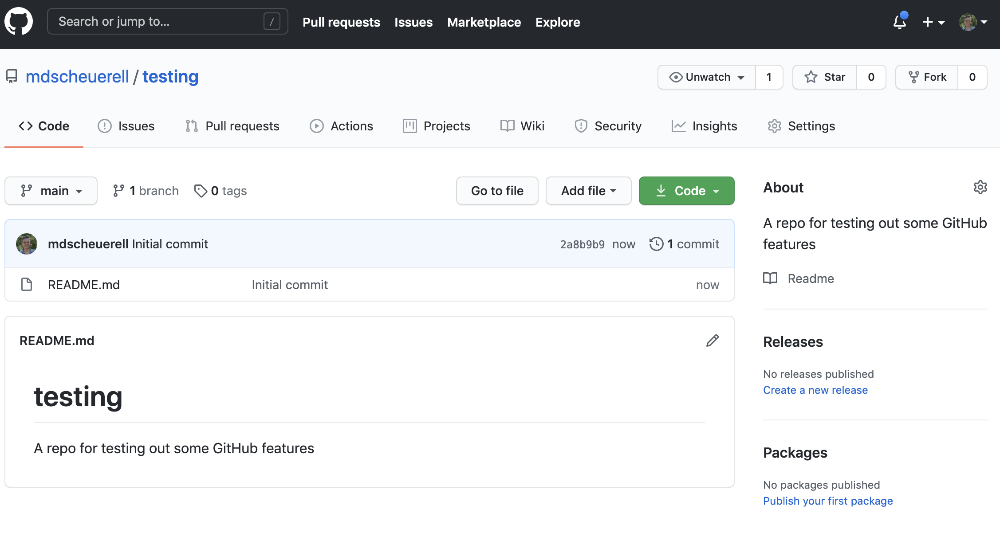
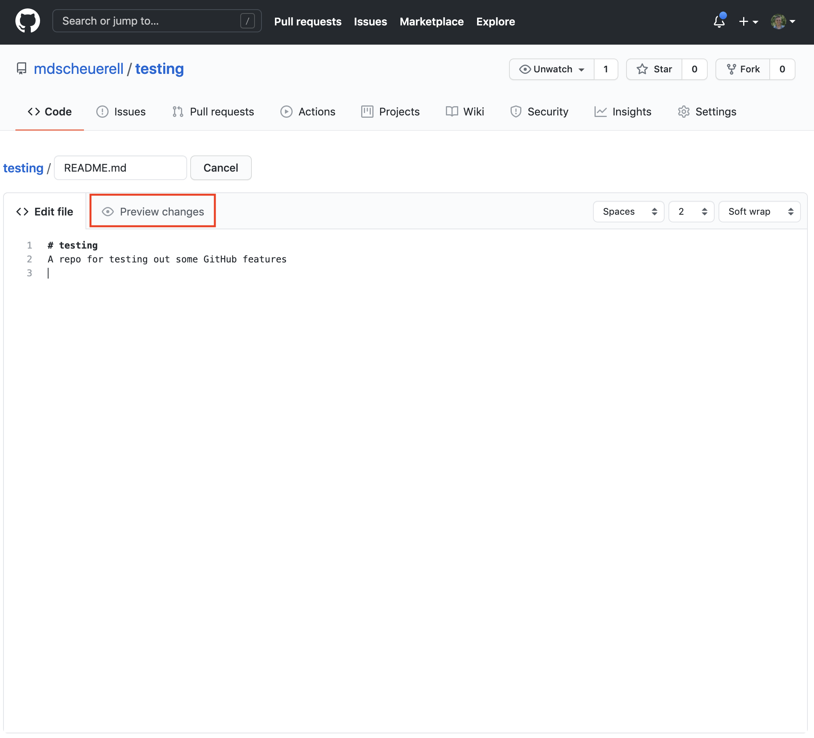

```{r setup, include=FALSE}
knitr::opts_chunk$set(echo = TRUE)
```

# What is GitHub?

GitHub is a code hosting platform for version control and collaboration. It lets you and others work together on projects from anywhere. GitHub itself is not a development tool, but rather a file hosting and collaboration site. In many ways, a social network like Facebook. You can build a profile, create projects to share with others, and follow the accounts of other users. GitHub is not linked to any one programming language like **R**, as you can find all kinds of projects based upon different languages there.

GitHub also runs **Git** in the background. Git is a version control software, which means it records changes to a file or set of files over time so that you can recall specific versions later. We'll learn more about Git in the next session.

# Repositories

A repository (or "repo" for short) is a directory or storage space for your projects on GitHub. Repositories can contain folders and files, images, videos, spreadsheets, and data sets. Most repos include a **README** file, which contains information about your project. GitHub makes it easy to add one at the same time you create your new repository. It also offers other common options such as a license file.

## Create a repository

Creating a repository is quite easy. Follow these steps to do so:

1. Log into your account on GitHub

2. Click on the `+` sign in the upper right and select `New repository`

<br>


<br><br>

3. Give your new repository a name. You can use underscores `_` and hypens `-` as text delimiters if you'd like. For now, call it **testing**.

<br>



<br>

4. Enter some descriptive text in the **Description** field. This can be changed later, so you can keep it simple for now.

<br>


<br>

5. GitHub repos can be set to **Public** or **Private**. If set to public, anyone can browse the contents of your repo. If set to private, only you and those you specify as collaborators can view the contents of the repo. Go ahead and set it to the default **Public**.

<br>


<br>

6. When you create a repo, you have the option of initializing it with a **README** file, a `.gitignore` file, and a license. For now, just check the box next to **Add a README file**.

<br>


<br>

7. When you are finished, click on the green **Create repository** button.

<br>



<br>

8. You now have a new repo that is ready to be populated with folders, code, data sets, etc.

<br>



# Markdown

Markdown is a simple markup language for creating formatted text using a plain-text editor. It makes use of some special characters for formatting headers and text. GitHub automatically recognizes Markdown files with a `.md` extension and renders them as formatted information. The repo we just created has one file in it: `README.md`, and its contents are displayed at the bottom of the repo.

## Writing text

The text in a Markdown document can be formatting in a number of ways. At a basic level, it's just various forms of text that are converted to nicely formatted features when the file is rendered.

### Headings

You can specify different levels of headings using the hash tag (pound) symbol `#`. By adding more `#` signs you can decrease the heading level. So, for example, the following

```
# Heading 1
## Heading 2
### Heading 3
#### Heading 4
```

will render to 

> # Heading 1
> ## Heading 2
> ### Heading 3
> #### Heading 4

### Emphasis

#### Italics

It's easy to add emphasis to text. For *italic* face, wrap the text with either a single asterisk (`*`) or an underscore (`_`). For example,

```
This is *italic*, but then so is _this_.
```

will render to 

> This is *italic*, but then so is _this_.

#### Bold

For **bold** face, wrap the text with either two asterisks (`**`) or an underscores (`__`). For example,

```
This is **bold**, but then so is __this__.
```

will render to 

> This is **bold**, but then so is __this__.

#### Bold & italic

For combined ***bold and italics*** face, wrap the text with three asterisks (`***`), such that

```
This is ***bold and italic***.
```

renders to

> This is ***bold and italic***.

#### Strike-through

If you want to indicate a deletion or ~~strike-through~~, just wrap the text in two tilde's (`~~`), such that

```
Oops, this is ~~a mistake~~.
```

will render to 

> Oops, this is ~~a mistake~~.

#### Underline

Unfortunately, Markdown does not include a built-in format for <u>underlining text</u>. You can, however, use regular HTML tags to do so. So, for example,

```
This bit is <u>underlined</u>.
```

results in

> This bit is <u>underlined</u>.

[Aside: It turns out that you can use all kinds of HTML tags within Markdown documents for additional formatting options.]


### Block quotes

You can specify a block quote by preceding it with the `>` symbol, such that

```
> I have a dream that one day this nation will rise up and live out the true meaning of its creed: 'We hold these truths to be self-evident, that all men are created equal.'
```

yields

> I have a dream that one day this nation will rise up and live out the true meaning of its creed: 'We hold these truths to be self-evident, that all men are created equal.'

### Lists

You can include ordered (numbered) lists, unordered (bulleted) lists, or a combination of the two in Markdown documents as well. Numbered lists simply use a number and period (`1.`) followed by a space and the text. For example, this text

```
1. This is item 1  
2. Item 2 comes next
```
     
will render to
     
> 1. This is item 1  
> 2. Item 2 comes next

It also turns out that you don't even have to use consecutive numbers to make it work. For example,

```
1. This is item 1  
7. Item 2 comes next
```

will render to

> 1. This is item 1  
> 7. Item 2 comes next

You can specify unordered list with either an asterisk (`*`) or dash (`-`). For example, the following text 

```
* This is a thing 
* Here is another
- And yet another
```

will render to

> * This is a thing 
> * Here is another
> - And yet another

Mixed lists simply use a mixture of the two constructs, such that 

```
1. This is item 1
   * This is a thing
   * Here is another  
2. Item 2 comes next
   - And yet another
```

will render to

> 1. This is item 1
>    * This is a thing
>    * Here is another  
> 2. Item 2 comes next
>    - And yet another
  
### Links

You can insert links to websites, other files, and other locations within a file. For websites, there are several options. The first is to simply write out the full address inline (eg, http://www.google.com) and it will parse correctly. You can also use shorthand text to hide the full address or make a sentence more readable. To do that, include the name in square brackets followed by the address inside parentheses For example,

```
Please conduct your search from [this link](http://www.google.com).
```

will render as

> Please conduct your search from [this link](http://www.google.com).

### Inserting pictures

#### Inline

Inserting links to images works much the same as for websites, but you add an exclamation point (`!`) at the beginning of the construct (and the text inside the square brackets in optional). For example, here is how to include a logo for this class, **which must exist in the same directory as the Markdown document**.

```
Check out the hex sticker I made for the class: 
```

which will yield this

> Check out the hex sticker I made for the class: 

## Displaying R code

One of the truly great features of Markdown is the ability to include code within a document. This course uses **R**, but people also use many other languages in Markdown documents (eg, Python).

### Blocks

The most common method for including code in your document is via code blocks, which can be numerous and separated by text, images, etc. Code blocks are delimited at the beginning and end by three back-ticks (\`\`\`). So, for example, here is a really basic code block

````
`r ''````
a <- 1
b <- 2
a / b
```
````

By default, Markdown will show the code and the output when the document is rendered, such that above code block would look like

```{r, eval=FALSE}
a <- 1
b <- 2
a / b
```

### Inline

You can also include code snippets within text by surround it with backticks (\`). For example,

```
I assigned the the temporary data frame to the variable \`tmp\`.
```

will result in 

> I assigned the the temporary data frame to the variable `tmp`.

<br>

## Edit the README

Let's edit our `README.md` file by clicking on the pencil icon in the upper right.

<br>


<br>

This brings up an editing window where you can add or modify existing text.

<br>



<br>


# Issues


# Projects


