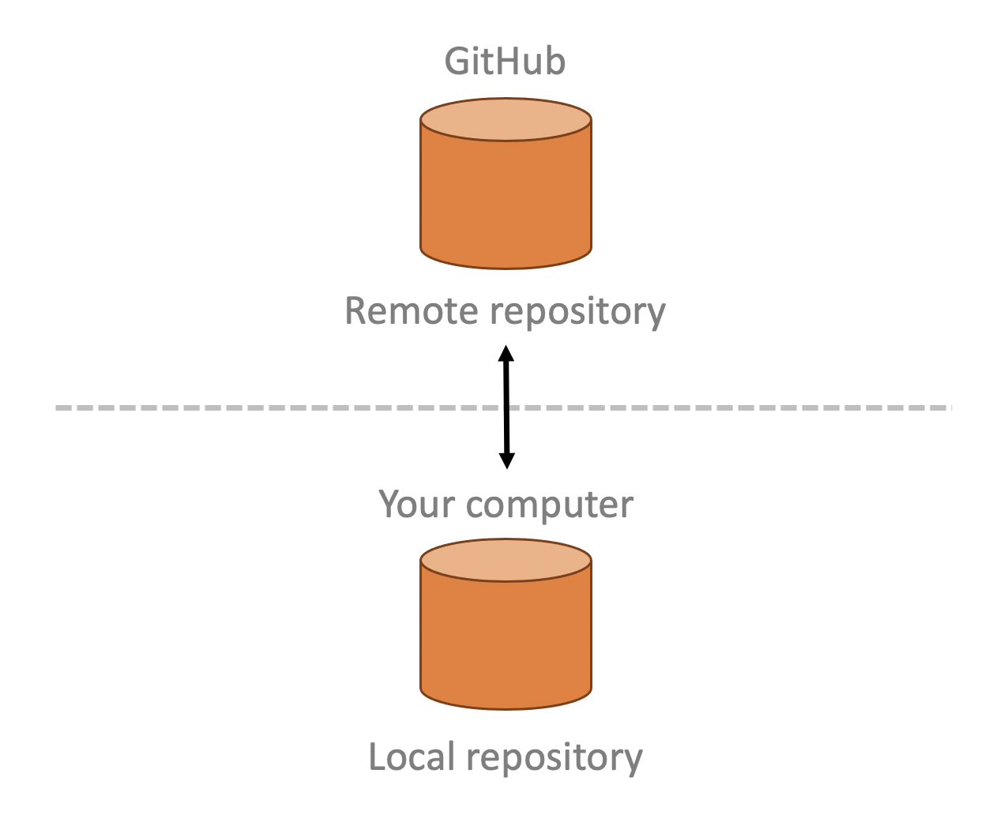
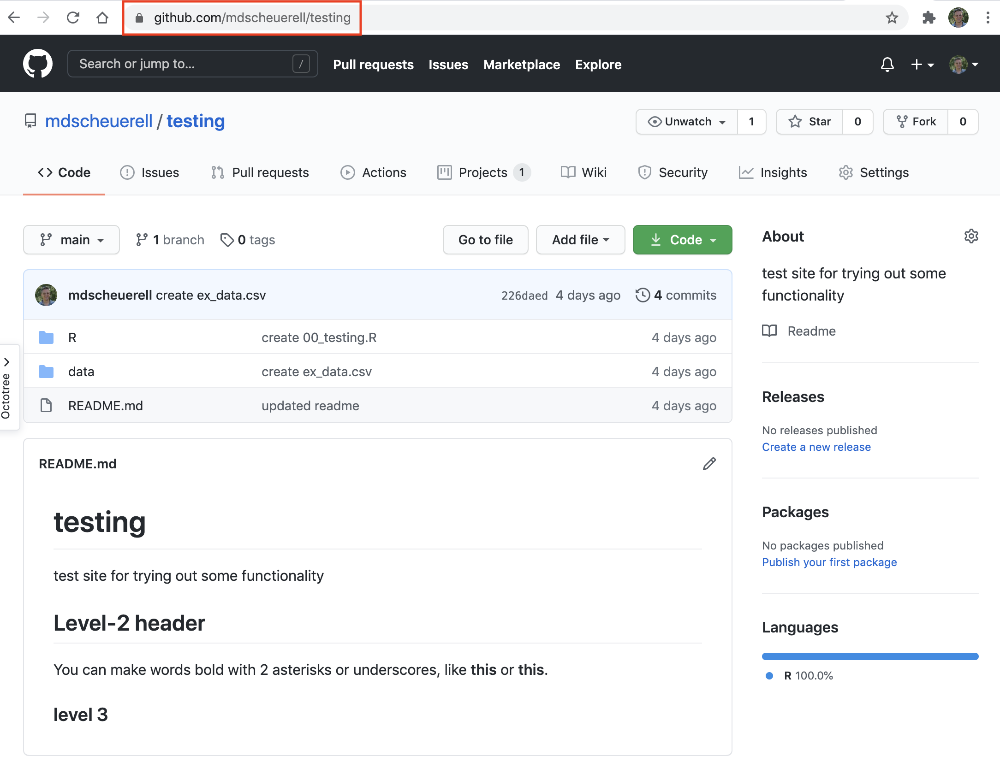
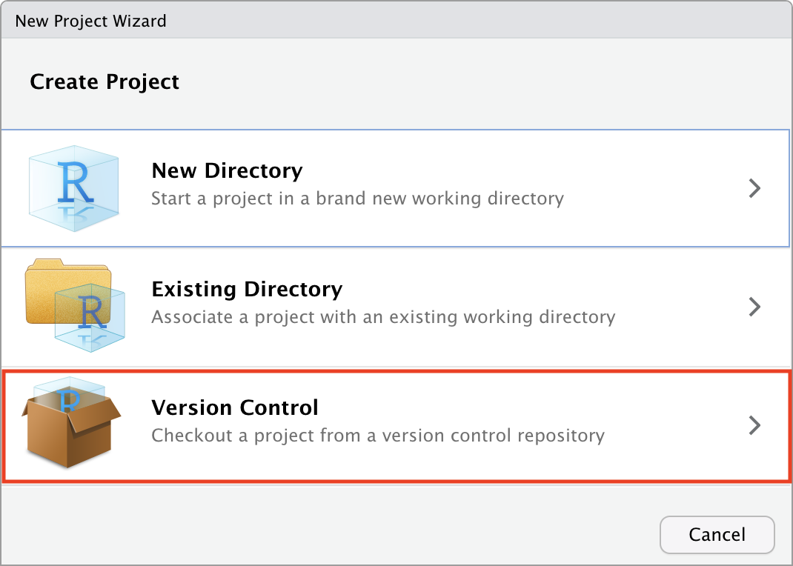
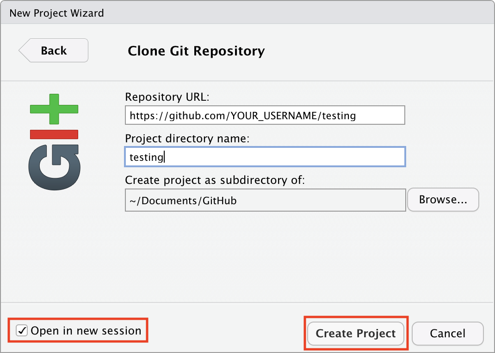

```{r setup, include=FALSE}
knitr::opts_chunk$set(echo = TRUE)
```

<br>

# Remote repositories

Remote repositories like GitHub allow you to store you code, data, and other information in a convenient online location. However, most of the time you will want to work on your personal computer and take advantage of a nicer programming interface, or so-called *integrated development environment* (IDE) like **RStudio**. Using remotes also allows for easier collaboration among people working in different places. This lesson will introduce you to working with remote repositories and show how to move your files back and forth from the cloud to a local computer. In general, our model for this process looks something like this.



***

# Create a project in **RStudio**

There are several ways to connect a remote repository to your local computer. Here we will see how to do so from within **RStudio**. **RStudio** provides a nice interface for using Git for version control via "Projects". Note that these are different than the [GitHub Projects we learned about here](https://fish497.github.io/website/lectures/week_02/lec_04_intro_github.html#Projects).

1. Navigate to the **testing** repo we created on GitHub in the lesson on [Intro to GitHub](https://fish497.github.io/website/lectures/week_02/lec_04_intro_github.html). Highlight and copy the full URL from your browser's address bar.



2. Start **RStudio**

3. Select *File* --> *New Project...*, which will bring up a dialogue box.

4. Select **Version Control**



<br>

5. Select **Git**


<br>

6. In the **Repository URL** box, copy/paste the full repo address from GitHub (note that `YOUR_USERNAME` in the location below should be *your* **GitHub** user name):


<br>

7. Tab to the next box **Project directory name**, which should auto-fill with the repo name `testing`.

8. Select the directory location where you'd like this to live. I **strongly** suggest choosing a location that is not under some other version control software such as **Dropbox**.


<br>

9. Check the box in the lower left that says "Open in new session" and then click on the **Create Project** button.



<br>

At this point **RStudio** will open a new instance with all of the project files listed. You are now ready to do work with your project in **RStudio**.

# Working on remotes in RStudio


