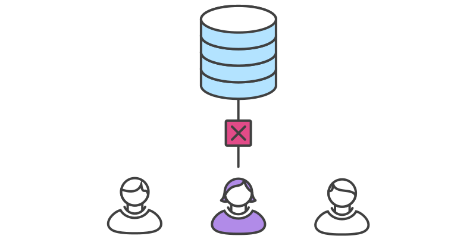

```{r setup, include=FALSE}
knitr::opts_chunk$set(echo = FALSE)
```

## Goals for today

* Understand different workflow models

> - Understand pros/cons of each


## What makes a successful workflow?

It *should* enhance the effectiveness of your team

It *should not* be a burden


## What makes a successful workflow? | Considerations

* Does this workflow scale with team size?

> - Is it easy to undo mistakes & errors?

> - Does it impose unnecessary overhead?


## Models for workflows

### Centralized

### Feature branch

### Forking


## Centralized workflow | Uses a single repo for all changes to the project


## Centralized workflow | John works on his code


## Centralized workflow


## Centralized workflow | Mary works on her code


## Centralized workflow | John pushes his commits `(git push origin main)`


## Centralized workflow | Mary tries to push, but it fails  `(git push origin main)`




## Centralized workflow | Mary *rebases* `(git pull --rebase origin main)`


## Centralized workflow | `rebase` moves Mary's commits to tip


## Centralized workflow | Mary resolves her *merge conflict*


## Centralized workflow | `git add  git rebase --continue`


## Centralized workflow | Mary pushes her commits `(git push origin main)`


## What's next?

We'll learn about GitHub and how to use it for personal and collaborative projects


