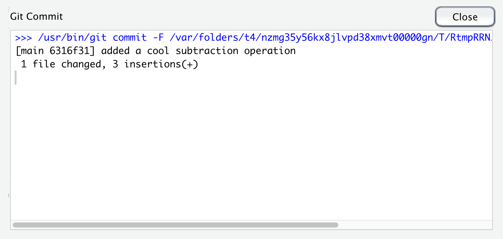

```{r setup, include=FALSE}
knitr::opts_chunk$set(echo = TRUE)
```

<br>

# Background

This document demonstrates some of the workflows we saw in class [here](https://fish497.github.io/website/lectures/week_03/lec_08_workflows.html). All of these workflows have some pros and cons. It's up to you and your team as to which one you adopt. Also note that your preferences might change, depending on the composition of your team and the task at hand.

# Centralized

A centralized workflow uses a single repo for all changes to the project. All team members pull from and push to the same repo.

Imagine John sits down to work on his new **testing** project that Mary and Sam have been working on as well. The first thing John does is **pull** from the remote repository.


<br>

Everything is up to date, so John works on the **R** script for doing some simple math operations. He adds 2 lines to the script to demonstrate a subtraction operation, and then saves his changes.


<br>

After basking in the glow of his wonderful new code, John decides he should take a break for awhile, so he commits his changes.


<br>



<br>

The last step before John takes a break is to **push** his local commit up to the shared repo on **GitHub**.


<br>

Oops--that did not go as expected! What went wrong? Well, **Git** is telling us that there are some changes on the remote repo that John does not have in his local copy. How did that happen? It turns out that Mary was also working on the project at the same time as John. In between the time that John sat down and pulled the changes from the remote repo (there were none at the time), Mary made some changes to the script, committed them, and pushed them to the remote repo. In looking at the error message from **Git**, John notices that it suggests he should **pull** the changes and integrate them into his own script.

John goes ahead and pulls Mary's recent changes to his local repo, which issues another warning about a so-called *merge conflict* in `R/00_testing.R` that John will have to fix.


<br>

When John inspects his version of `00_testing.R` he sees that **Git** has added some information to the script, which brackets the new changes that both John and Mary made:

```
<<<<<<< HEAD
## subtraction
num - den
=======
## addition
num + demo
>>>>>>> d1ab55e3cf1979efd0a61954305f742cfbb38e11
```


<br>

You can think of these new lines as "conflict dividers". The `=======` line is the center of the conflict. Everything between `<<<<<<< HEAD` and `=======` is content that exists in the local repo to which the `HEAD` ref is pointing. Everything between `=======` and `>>>>>>> d1ab55e3cf1979efd0a61954305f742cfbb38e11` is content that is present in the remote repo.

At this point, it would be a good idea for John to contact Mary and find out what her plans are, so he can avoid this problem in the future. After confirming that Mary is done making changes for awhile, John can return to resolving the current merge conflict. To do so, John inspects the new changes that Mary made and decides if he wants to merge them into his version of the file, or whether he wants to discard them. In this case, John is happy with the new addition operation that Mary made, so he accepts them by simply deleting the conflict dividers.


<br>

Now John can commit his resolved changes and push them to the remote repo.


<br>


<br>

Now John is all set on his side, but Mary should make sure that she pulls John's changes to her local repo before she starts working on the script again.

This scenario does not necessarily require two or more collaborators. For example, I know from personal experience that someone can do some work on a computer in their office, commit those changes, and then forget to push them before heading home. Upon arriving home, you could pull your changes to your laptop, make additional changes, and then commit and push them to the remote. Upon returning back to the office, you can encounter problems with committing a pushing those changes you forgot about the day before.

# Feature branch

# Forking


 


