```{r setup, include=FALSE}
knitr::opts_chunk$set(echo = TRUE, 
                      fig.align = "center", out.width = '90%')
```

<br>

# Introduction

This is a step-by-step guide to create a new database, user, and tables 
for Lake Washington (Seattle, WA, USA) plankton data and the Pacific Decadal Oscillation (PDO) 
climate variability index.

***

# Requirements

To begin, you should have **PostgreSQL** and **pgAdmin** installed. (Please note that the following steps were tested on **PostgreSQL** v13 and **pgAdmin** v4.3 running on macOS Big Sur.) 

***

# Getting oriented in pgAdmin

Before we can create anything, we need to connect to **PostgreSQL** with **pgAdmin**. It is important to note that current version of **pgAdmin** runs in your web browser. 

The first time you open **pgAdmin** you will be prompted to set a password. 

The **pgAdmin** dashboard provides a database object browser along the left side of the window. In the object brower click on `Servers`. Then click on `PostgreSQL 13`. You will be asked for the `postgres` superuser password you set up when you first installed **PostgreSQL**. Provide the password and **pgAdmin** will connect to the database. 

Under `PostgreSQL 13` you will then see `Databases`, `Login/Group Roles`, and `Tablespaces`.

## Databases

- Click on `Databases` to see one database named `postgres`. The `postgres` database is the only database created automatically when **PostgreSQL** is installed.
  
- Click on the `postgres` database and then click on `Schemas` at the bottom of the submenu. You will see there is one schema in the database named `public`. 
  
- Click on the `public` schema to see the long list of database object typeslisted alphabetically.

## Login/Group Roles

- Click on `Login/Group Roles` to see eight roles that start with `pg_` and one user named `postgres`. 

  - Roles and users can be distinguished by their different icons in the object browser. 
  
  - The `postgres` user is the superuser you are using to connect into the database. 

## Tablespaces

 - Tablespaces allow you to control where in the file system you database objects are stored. 
 
 - Tablespaces are used for performance and disk space management. 
 
 - We are using default tablespaces in this exercise, but you can learn more about adding and configuring tablespaces in the **PostgreSQL** [documentation](https://www.**PostgreSQL**.org/docs/current/manage-ag-tablespaces.html)

***

# Create a new user

Right now we're connected to the database as the `postgres` super user, so we want to set up a new user and new database for our project and then disconnect as `postgres` and sign in as our new user. To create a new user  

- right click on `Login/Group Roles`  

- click on `Create >`  

- click on `Login/Group Roles ...`, which will open a window in **pgAdmin** to create a new Login/Group Role  

<br>
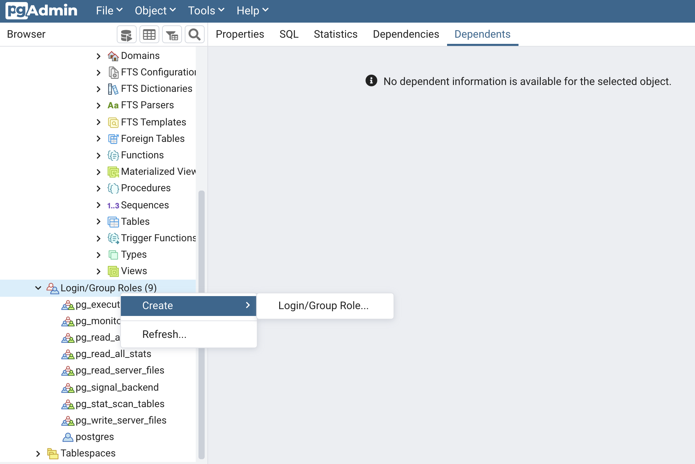
<br><br>

- Under the `General` tab, give the new role a name, for this example I am naming my user `lake_wa` 

<br>
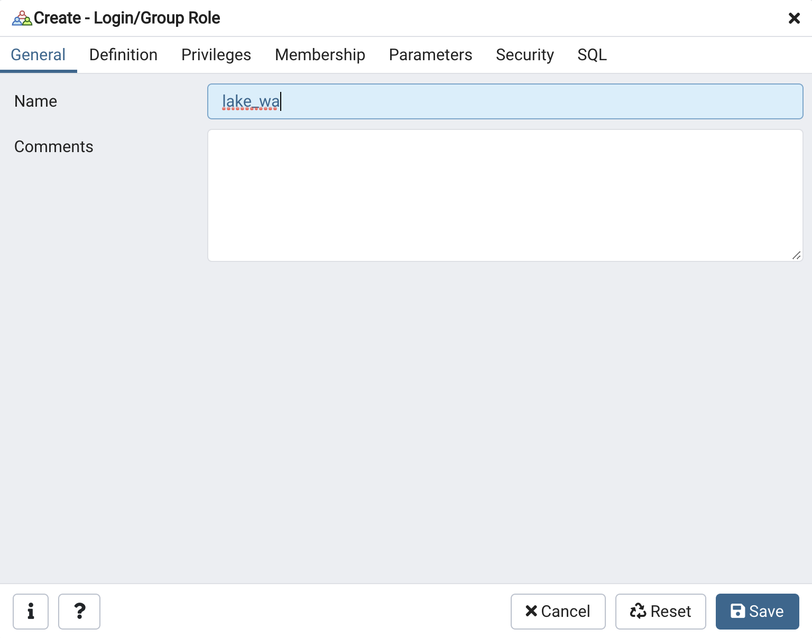
<br><br>

- Click on the `Definition` tab at the top of the window and provide a password for your user

<br>

<br><br>

- Click on the `Privileges` tab at the top of the window to assign permissions for the role

  - Change `Can login?` to "Yes"  
  - Change `Create databases?` to "Yes" 
  
- Click the blue **Save** button when you are done

<br>
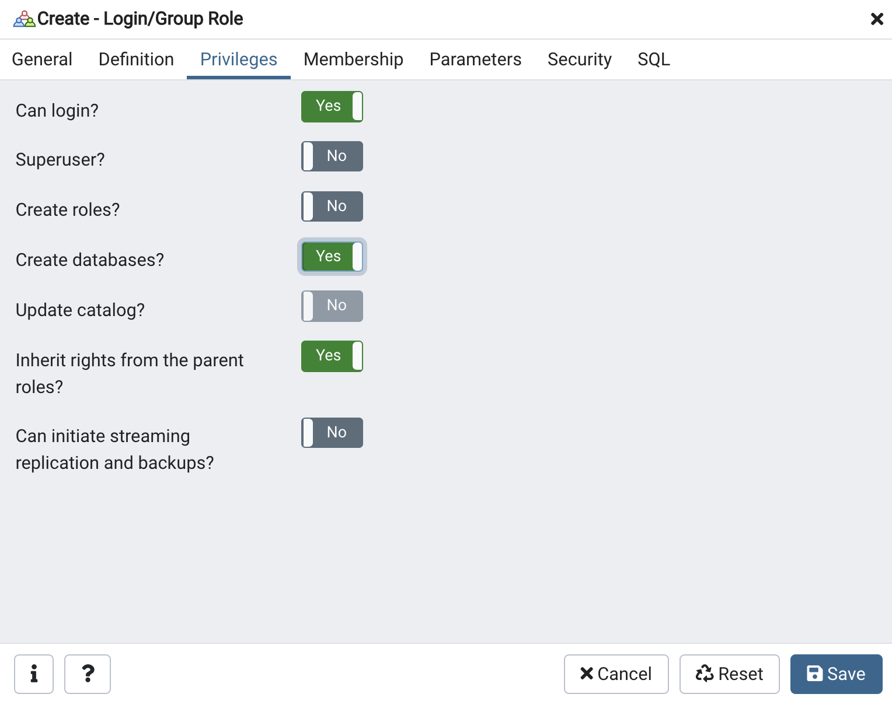
<br><br>

- Click on the SQL tab to see the actual SQL that **pgAdmin** is generating for you (note that the SQL view masks the password you provided). Here's the SQL to create my new user:

```
CREATE ROLE lake_wa WITH
	LOGIN
	NOSUPERUSER
	CREATEDB
	NOCREATEROLE
	INHERIT
	NOREPLICATION
	CONNECTION LIMIT -1
	PASSWORD 'xxxxxx';
```

<br>
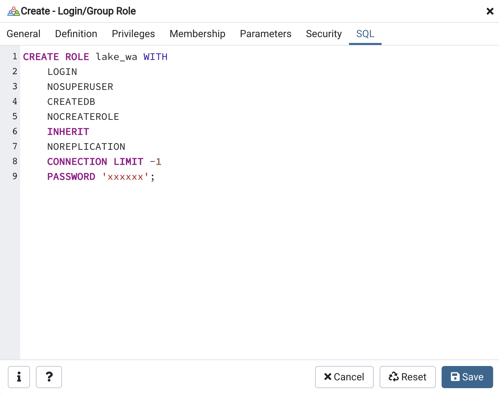
<br><br>

- Click `Save` and then verify that your user now appears under `Login/Group Roles`

***

# Switch users

- Right click on `PostgreSQL 13` in the object browser, and then click `Disconnect Server` 

<br>
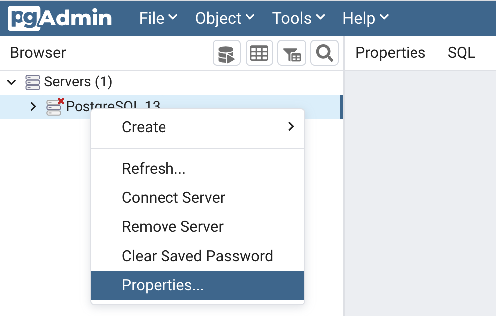
<br><br>

- A window will pop up asking if you are sure you want to disconnect--click `Ok` 

- Right click on `PostgreSQL 13` in the object browser and then select `Properties` 

<br>
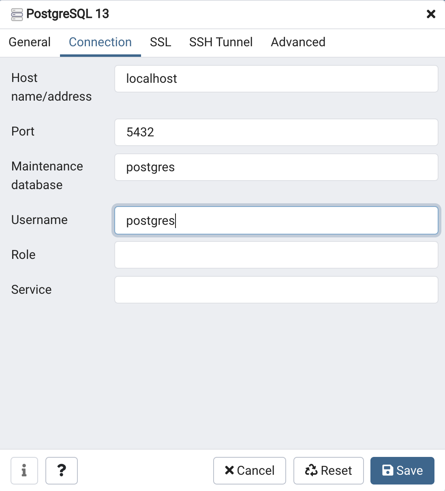
<br><br>

- A window will pop up titled **PostgreSQL** 13; click the `Connection` tab at the top

- Under `Username` change `postgres` to `lake_wa` (or whatever you named your user)

<br>
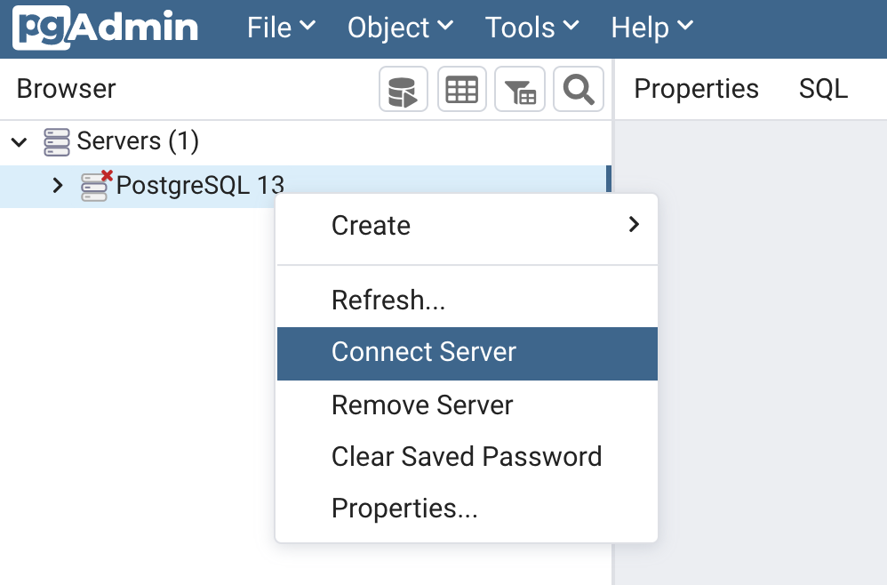
<br><br>

- Click the blue **Save** to close the window and save your changes

- Double click on `PostgreSQL 13` in the object browser

- A window will pop up asking for the password for the `lake_wa` user

- Input the password and click the blue **OK** button

<br>
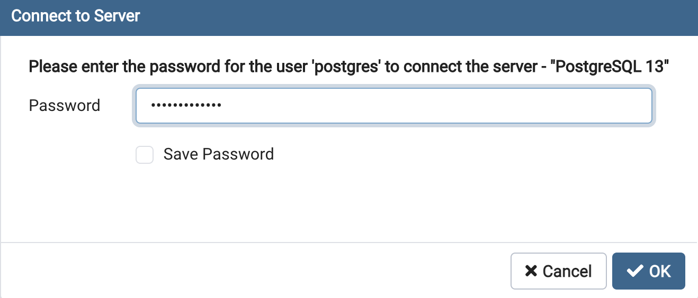
<br><br>

- You are now connected to **PostgreSQL** as your new user

***

# Creating a new database

Next we are going to create a new database to hold our Lake Washington and PDO data. 

- Right click on `Databases` and then select `Create >` and then `Database ...`

<br>
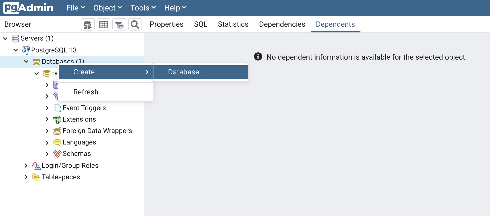
<br><br>

- A window will pop up called `Create - Database`

- Give your new database a name, I named mine `lake_wa` (note that **PostgreSQL** assumes we want the current user `lake_wa` to own the new database, which is OK, so there is nothing to change here) 

<br>

<br><br>

- Click on SQL to see the statement that **pgAdmin** is writing for you to create the database. 

My create database statement looks like:

```
CREATE DATABASE lake_wa
    WITH 
    OWNER = lake_wa
    ENCODING = 'UTF8'
    CONNECTION LIMIT = -1;
```

<br>
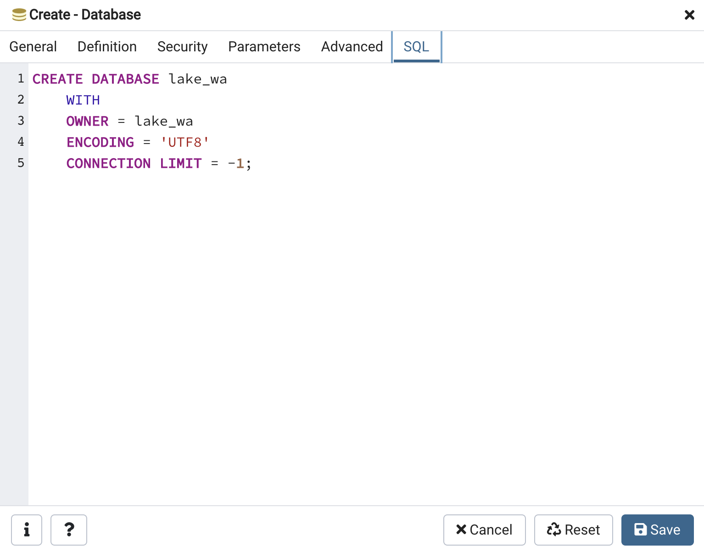
<br><br>

- Click the blue **Save** button and then verify you now see `lake_wa` as a second database beside `postgres` in the object browser

- Click on the `lake_wa` database to connect to it

<br>
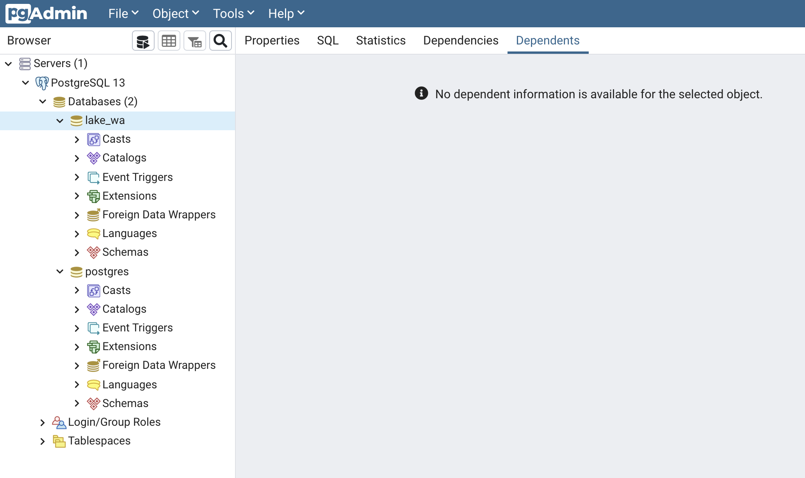
<br><br>

Now we have our user and our database, and we can next make the data tables that will hold our data. But before we start making the data tables, we need to inspect the data to know what their tables should look like.  

## Preparing the data

The data for this example are available as two `.csv` files

1. `lwa_limno.csv`

2. `pdo_data.csv`

which can be found in the `data` directory [here](https://github.com/sureL/postgres-tutorial). Download both data files to your local computer either directly from the repo or by cloning or forking the repo.

Generally we need to know the field (column) names in the data files and what type of data are contained in each field before we can set up the tables. Fortunately for us, some nice people made a [free tool](https://www.convertcsv.com/csv-to-sql.htm) that will give you the **SQL** for a `.csv` file that we can use to quickstart the process.

### Lake Washington limnology {#create-lwa}

- Open up the [Convert CSV to SQL tool](https://www.convertcsv.com/csv-to-sql.htm)

- Under **Step 1**

    - Choose any of the 3 following options to select the `lwa_limno.csv` file:

        1) "Enter Data" allows you to copy/paste from the raw csv format [here](https://raw.githubusercontent.com/sureL/postgres-tutorial/main/data/lwa_limno.csv)
        2) "Choose File" allows you to navigate to and select the location for your locally saved `lwa_limno.csv` file
        3) "Enter URL" allows you to copy the URL for the raw data [here](https://raw.githubusercontent.com/sureL/postgres-tutorial/main/data/lwa_limno.csv) and paste it into the box  

    - After selecting the input, the converter will read in the `.csv` file

- (You can skip **Step 2**)

- Under **Step 3**

    - add underscores (`_`) to 3 of the field names to separate words:

        1) `Otheralgae` becomes `Other_algae`  
        2) `Nondaphnidcladocerans` becomes `Non_daphnid_cladocerans`
        3) `Noncolonialrotifers` becomes `Non_colonial_rotifers`

    <br>
    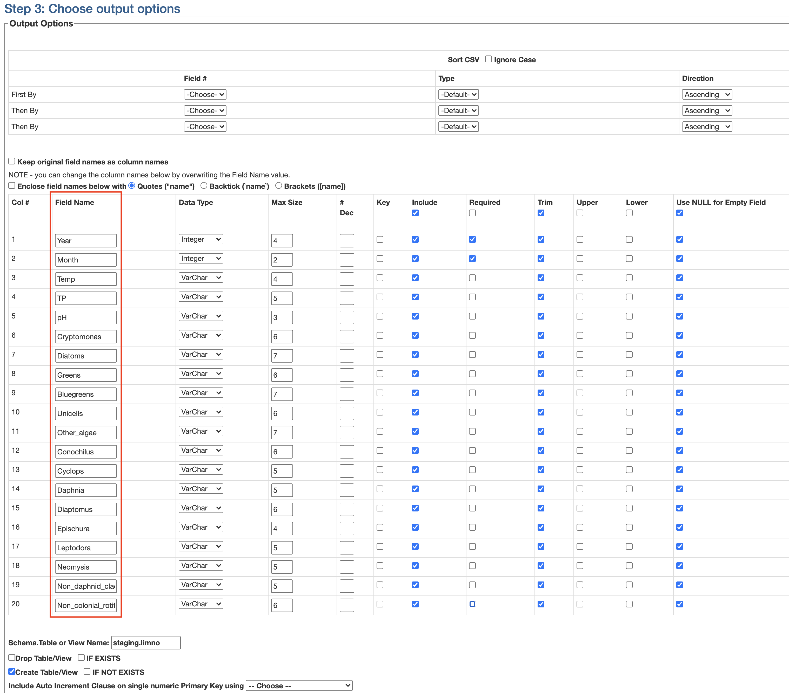
    <br><br>
    
    - In the **Field Name** for `Year`, uncheck the box under **Key**
    
    <br>
    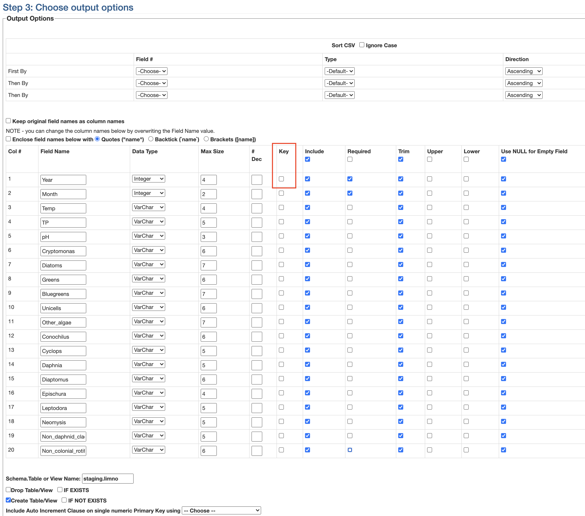
    <br><br>
    
    - In the **Required** column, leave the check marks for `Year` and `Month` and uncheck **all** of the rest of the fields

    <br>
    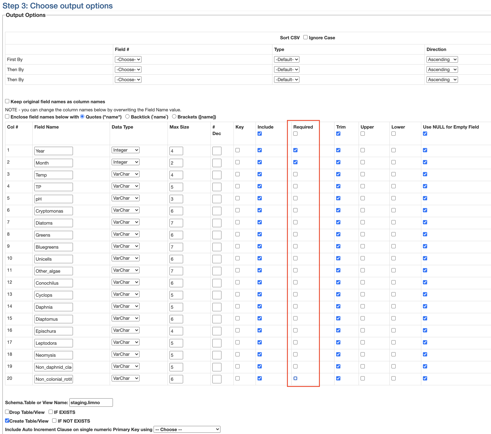
    <br><br>
    
    - Under the `field name` and `data type` section, look for the option to specify the `Schema.Table` name and enter `staging.limno`

    <br>
    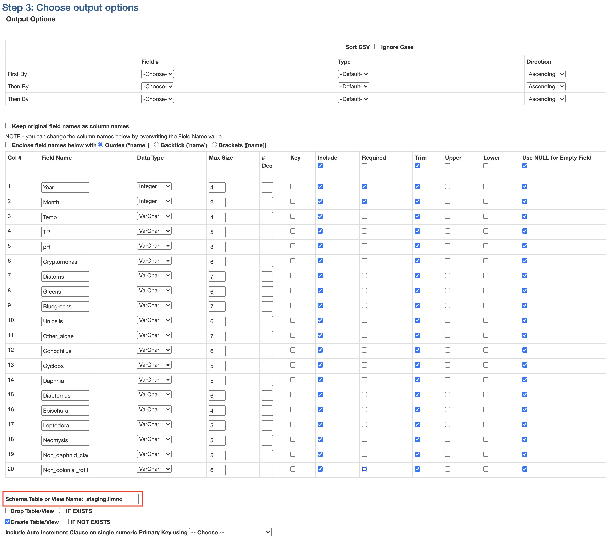
    <br><br>
    
    - Scroll down further and under **For INSERT**,
    
        1) check the box next to **Use one INSERT/REPLACE statement with multiple VALUES clauses**, and  
        2) enter 400 for **How many?**

    <br>
    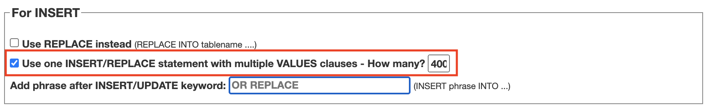
    <br><br>
    
- Under **Step 4**

    - Click the **CSV To SQL Insert** button to bring in the new configuration options you just set

    <br>
    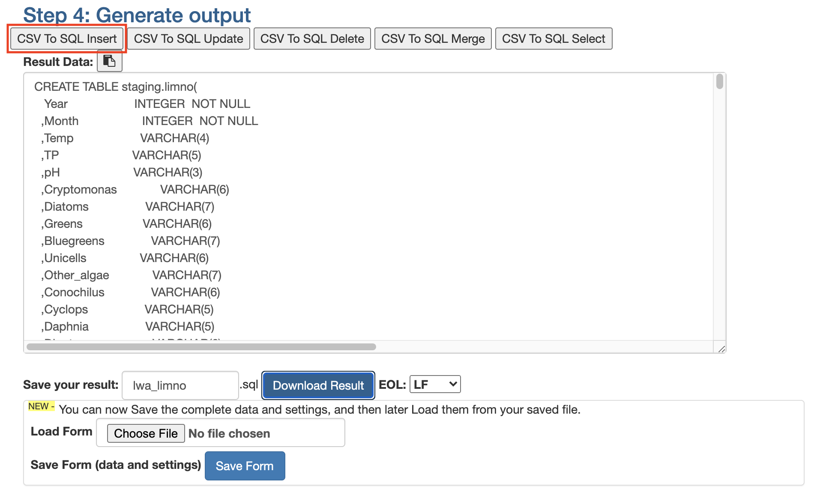
    <br><br>
    
    - In the **Save your result** box, enter `lwa_limno`

    <br>
    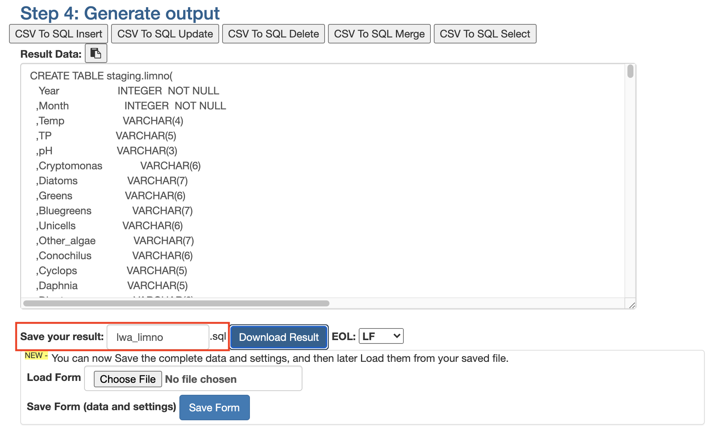
    <br><br>
    
    - For the line endings, choose either `CRLF` if you are on a Windows computer and `LF` otherwise

    <br>
    
    <br><br>
    
    - Click the blue `Download Results` button to download the `lwa_limno.sql` file to your computer 

    <br>
    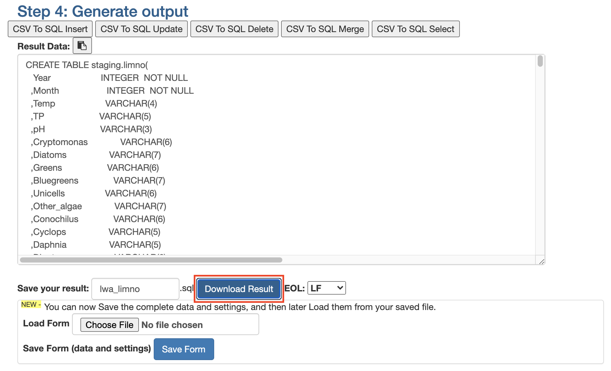
    <br><br>
    
### Pacific Decadal Oscillation

Now Repeat those steps for the `pdo_data` replacing `lwa_limno` with `pdo_data` throughout.

- Begin by returning to **Step 1** in the [Convert CSV to SQL tool](https://www.convertcsv.com/csv-to-sql.htm)

    - Click on the blue **Clear Input** button to clear all of the information from `lwa_limno.csv`
    
    - Choose any of the 3 following options to select the `pdo_data.csv` file:

        1) "Enter Data" allows you to copy/paste from the raw csv format [here](https://raw.githubusercontent.com/sureL/postgres-tutorial/main/data/pdo_data.csv)
        2) "Choose File" allows you to navigate to and select the location for your locally saved `pdo_data.csv` file
        3) "Enter URL" allows you to copy the URL for the raw data [here](https://raw.githubusercontent.com/sureL/postgres-tutorial/main/data/pdo_data.csv) and paste it into the box  

    - After selecting the input, the converter will read in the `.csv` file

    <br>
    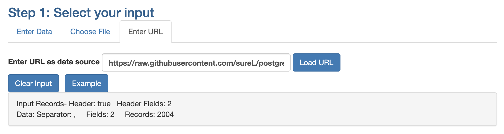
    <br><br>
    
- (You can skip **Step 2**)

- Under **Step 3**

    - Leave everything as is in the **Field Name**, **Key**, and **Required** columns
    
    <br>
    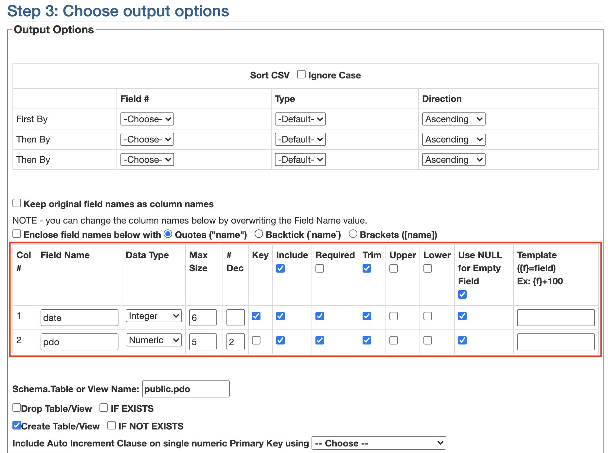
    <br><br>
    
    - Under the `field name` and `data type` section, look for the option to specify the `Schema.Table` name and enter `public.pdo`

    <br>
    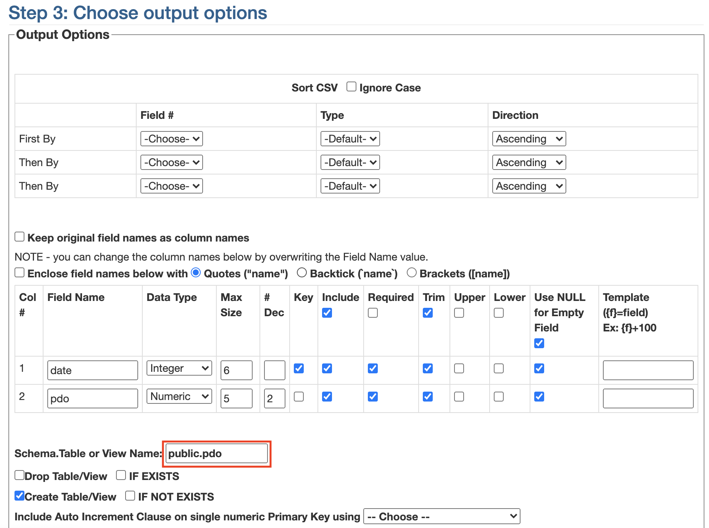
    <br><br>
    
    - Scroll down further and under **For INSERT**,
    
        1) check the box next to **Use one INSERT/REPLACE statement with multiple VALUES clauses**, and  
        2) enter 2005 for **How many?**

    <br>
    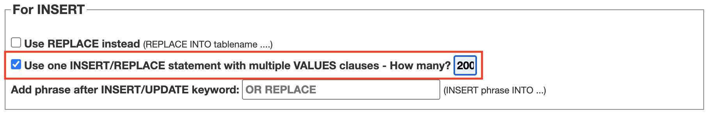
    <br><br>
    
- Under **Step 4**

    - Click the **CSV To SQL Insert** button to bring in the new configuration options you just set

    <br>
    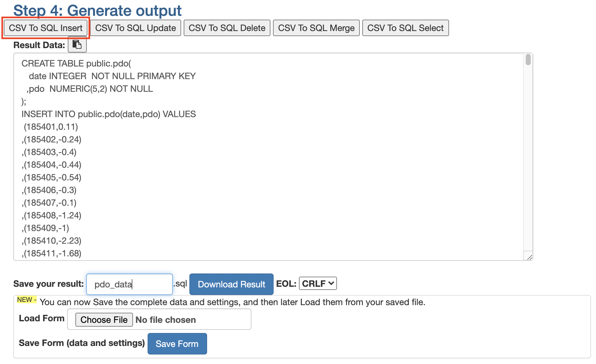
    <br><br>
    
    - In the **Save your result** box, enter `pdo_data`

    - For the line endings, choose either `CRLF` if you are on a Windows computer and `LF` otherwise

    - Click the blue `Download Results` button to download the `lwa_limno.sql` file to your computer 

    <br>
    
    <br><br>
    
***

# Create a new Schema

Before we import our data from the `.csv` files, we need to create a new *Schema*. 

- Right-click on **Schemas** and select `Create > Schema...`

<br>
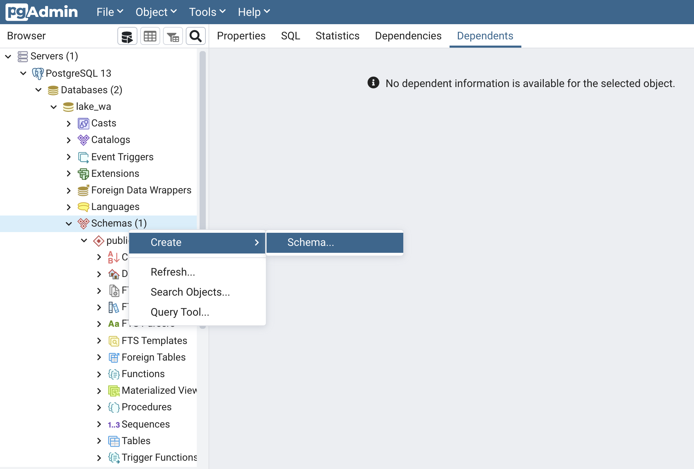
<br><br>

- In the dialogue box that opens up, click on the `General` tab and enter `staging` in the `Name` field

<br>
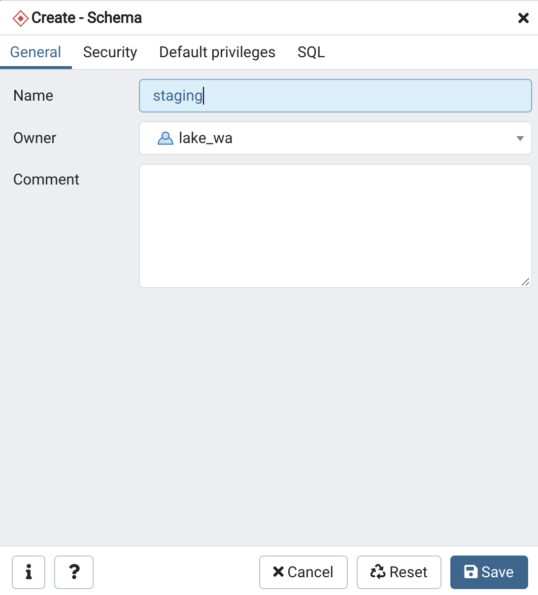
<br><br>

- Click on the `SQL` tab and you should see the following SQL commands

```
CREATE SCHEMA staging
    AUTHORIZATION lake_wa;
```

<br>
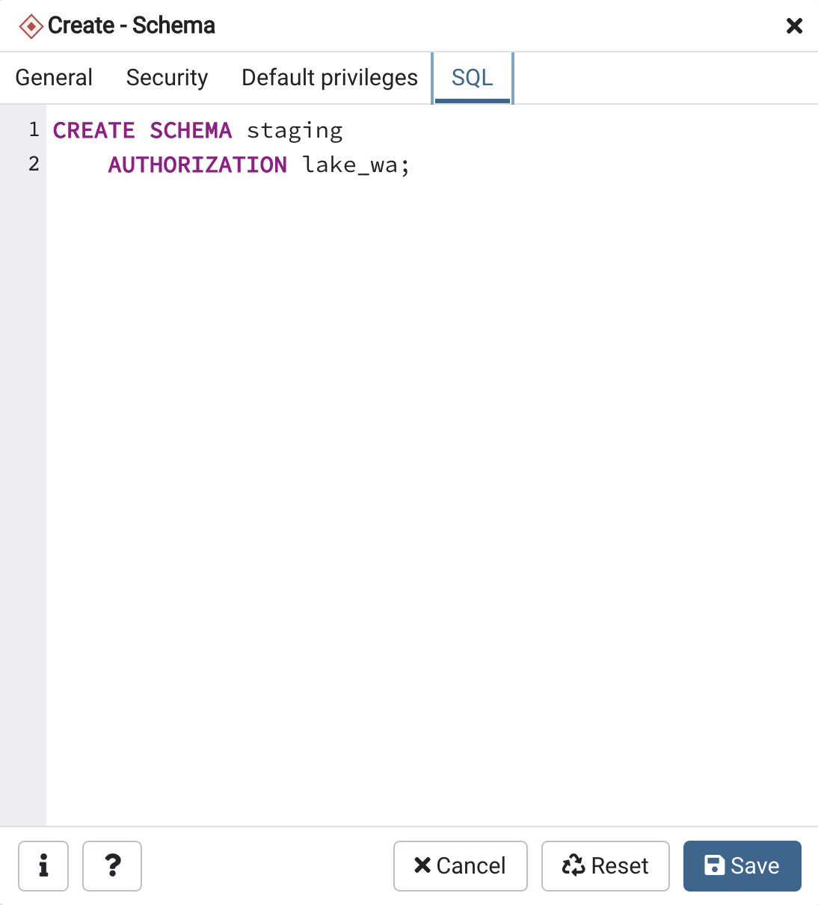
<br><br>


***

# Creating the tables

We now need to create the tables for the data within the database. 

- In **pgAdmin**, click the `Tools` tab at the top and then select `Query Tool`

<br>

<br><br>

- A query editor window will open in **pgAdmin**

- Click on the open folder icon, which will allow you to select the SQL file we [saved above](#create-lwa)

<br>
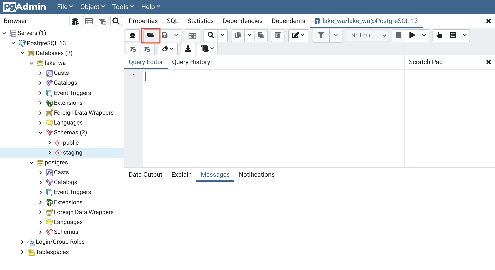
<br><br>

- Navigate to the location where you saved your `lwa_limno.sql`, select it, and then click the blue **Select** button

<br>
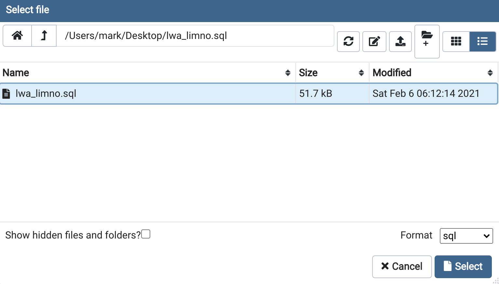
<br><br>

- You will now see the SQL code in the editor window, that begins with 

```
CREATE TABLE staging.limno(
   Year                  INTEGER  NOT NULL
  ,Month                 INTEGER  NOT NULL
```

- Click the triangular play button at the top to execute the **SQL**

<br>
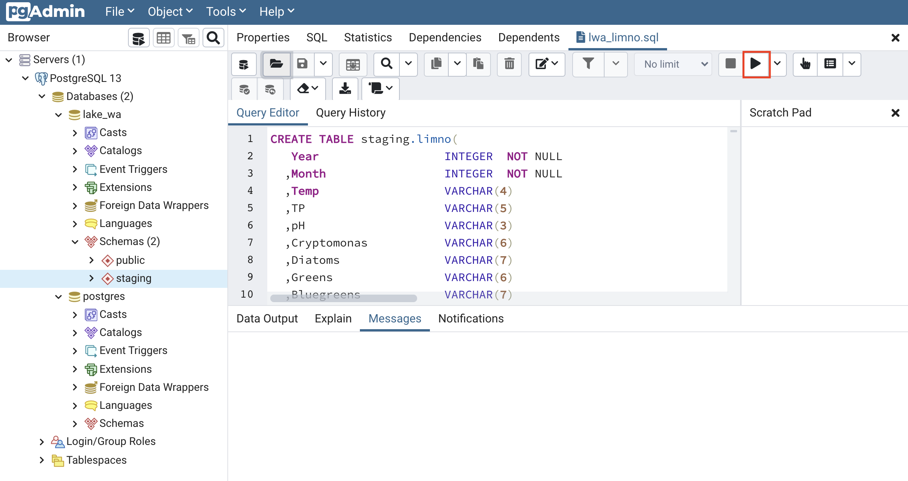
<br><br>


- The code should execute now and **pgAdmin** should respond

```
INSERT 0 396

Query returned successfully in 92 msec.
```

(Note that the time it took the query to run will depend on your computer resources.)

<br>
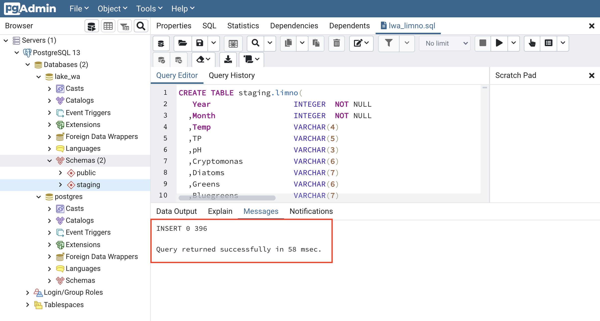
<br><br>

- In the **pgAdmin** object browser, click on `Schemas > staging > Tables > limno` to see your new table `stage_lake_wa`

- Right click on the `limno` table and then click `View/Edit Data` and then `All Rows`

<br>

<br><br>

- The query editor will show you the following query used to call all records for the table in the upper pane and show the result set for that query in the lower pane. 

```
SELECT * FROM staging.limno
```

<br>
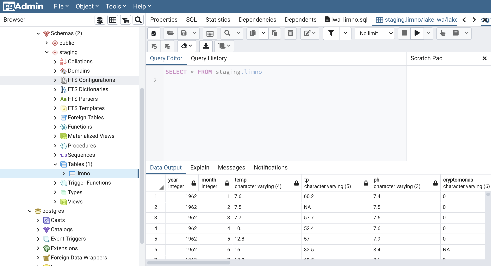
<br><br>

