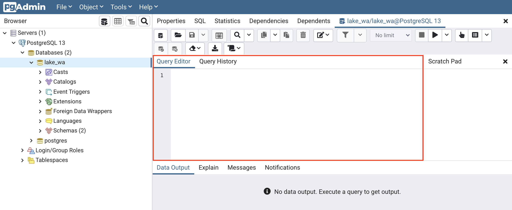
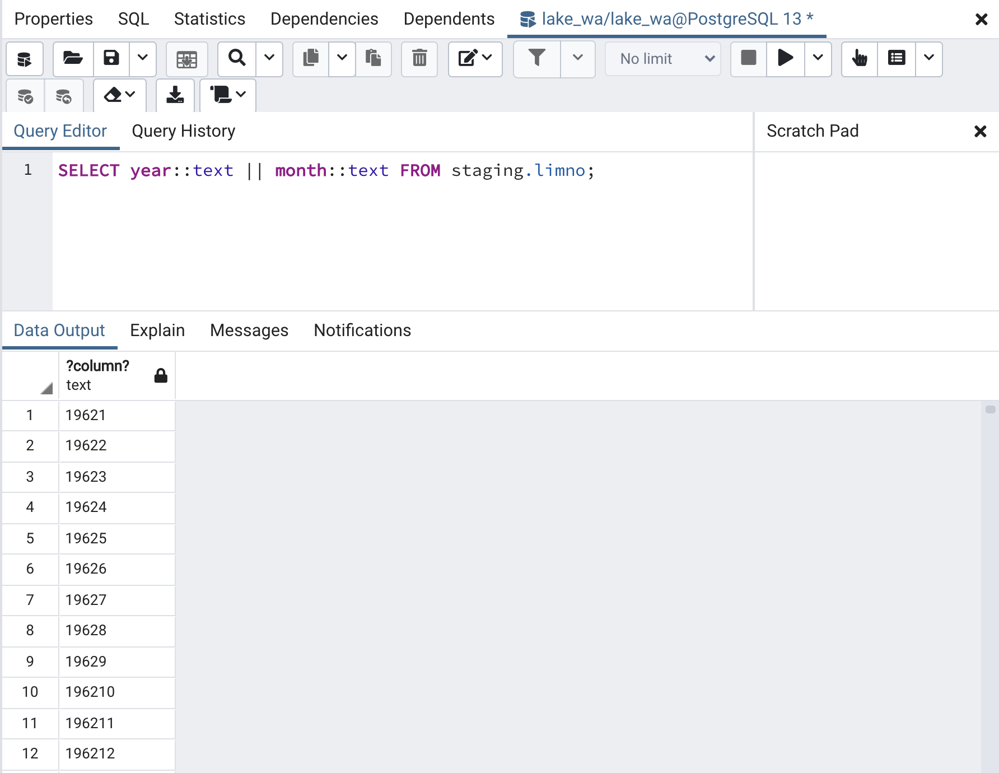
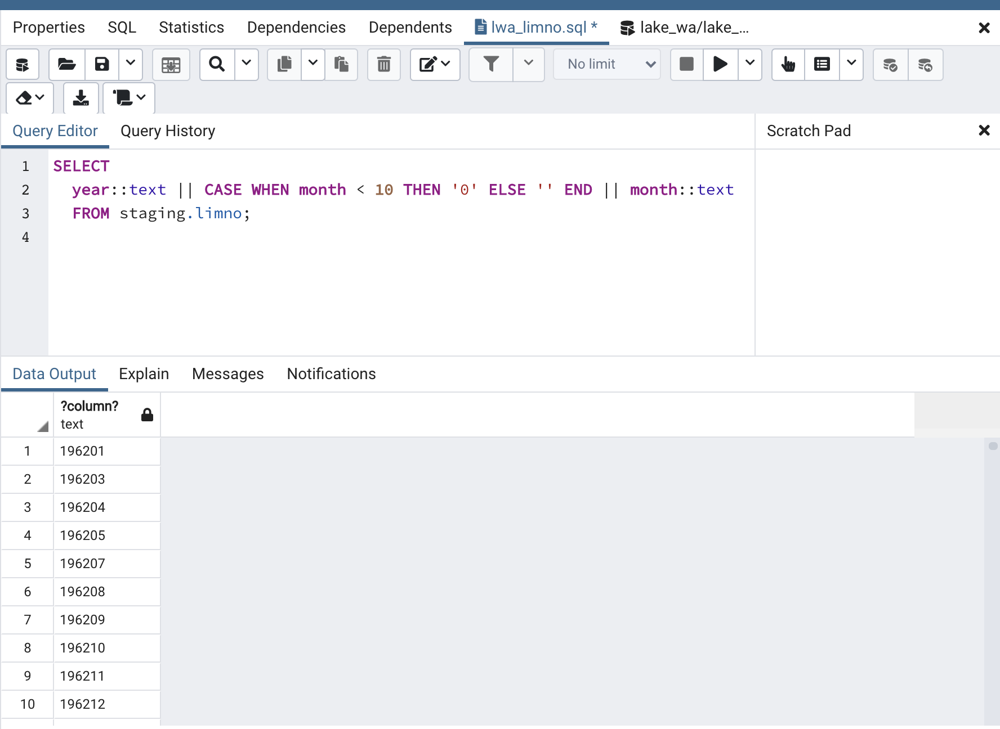
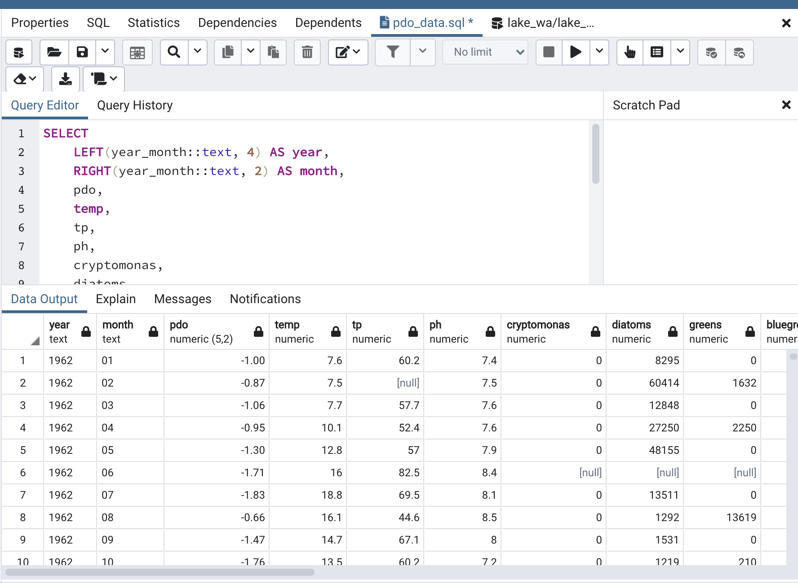
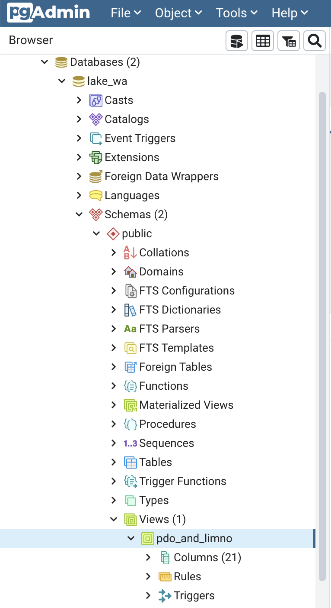

```{r setup, include=FALSE}
knitr::opts_chunk$set(echo = TRUE, 
                      fig.align = "center", out.width = '90%')
```

<br>

# Background 

We [saw previously](lec_14_intro_databases.html) how to create a PostgreSQL database and schema for staging our data. Recall that we used the [Convert CSV to SQL](https://www.convertcsv.com/csv-to-sql.htm) website to generate the `CREATE TABLE` and `INSERT INTO` SQL statements used to import our csv data. We also created a `staging` schema in our database, which will allow us to write our limno data there so we can clean it up and then write the cleaned version into our final table with numeric data types. 

Here we will learn how to:

- Insert data into our tables 

- Clean up the data

- Modify the data

- Write data between tables

- Join our tables together in a query

- Create a view of our joined query

SQL scripts for each step are available [here](https://github.com/sureL/postgres-tutorial/tree/main/sql/ecology_example). 
As you've seen elsewhere in class, all of the SQL scripts have number prefixes to show the order in which they should be run.

***

# Joining tables

One of the essential elements to be able to join the monthly data in `limno` and `pdo` together is to insure the fields we will use to join the tables have the same data format. In `lwa_limno.csv` we have one field for `Year` and 
a second field for `Month`, but in the `pdo_data.csv` we have only one field called `Date` that has the year and month concatenated together. 

Year/month format in `limno`

```
year | month
------------
1962 |     1 
1962 |     2 
```

Year/month format in `pdo`

```
Date
------
199001
199002
```

We could convert either data set to match the other, but here we'll convert the `limno` data to a concatenated year plus month value to match `pdo`. 

***

# Create new field

Now we need to create a new field in the `limno` table where we can write a new `year_month` concatenation. To add a field to an existing table, we use the SQL `ALTER TABLE` command. Note that fields added to tables via the `ALTER TABLE` command are appended to the end of the existing table fields. 

* Go back to **pgAdmin** and from the menu at the top, select `Tools > Query Tool` to open up the query editing tool


<br>

* Copy/paste the following SQL code into the editor window

```
ALTER TABLE staging.limno
ADD COLUMN year_month text;
```

* [*Alternatively*] Use the open file button to select the saved SQL file `2_alter_table_staging_limno.sql` and then run it

***

# Concatenate fields

Now that we have a field we can write our new concatenation into, we need to create SQL to concatenate two fields into one field. The PostgreSQL concatenation operator is double pipes `||`. Because the `year` and `month` fields in the table are integers, we need to cast their data types to text so that we can contenate them together. To cast a field to a different data type in
PostgreSQL, you follow the field name with double colons `::` and then the data type (eg, `Year::text`).

If we query `limno` to try our concatenation, we can run the following to check if that gives us what we need for the concatenated field.

```
SELECT year::text || month::text FROM staging.limno
```


<br>

That looks pretty good, but all of the `Date` values in `pdo_data.csv` are six digits--for single digit months the month is written `01` instead of `1` - and our `limno` concatenation doesn't match that. Therefore, we need to pad the month with a `0` in the concatenation, but only for January through September (ie, single digit months).

To write conditional logic in SQL we use the `CASE` statement. The `CASE` statement context is

```
CASE WHEN XX THEN YY ELSE ZZ END
```

Note that we can make case statements more complicated by nesting additional `WHEN` clauses like

```
CASE WHEN XX THEN YY WHEN AA THEN BB ELSE ZZ END
```

We can check our conditional logic statement with the following SQL code:

```
SELECT
  year::text || CASE WHEN month < 10 THEN '0' ELSE '' END || month::text
  FROM staging.limno;
```


<br>

That all looks good, so now we can add the new `year_month` column to our table with the `UPDATE` command

* To update our table using the concatenation statement with conditional logic to include a `0` for single digit months, copy/paste the following SQl code into the editor and press play

```
UPDATE staging.limno
SET year_month = year::text || CASE WHEN month < 10 then '0' ELSE '' END || month::text;
```

 * [*Alternatively*] Use the open file button to select the saved SQL file `3__staging_limno.sql` and then run it

***

# Changing `NA` to `NULL`

Recall that the notion of a missing value in a SQL database is different than in **R**. In **R** we use `NA` to designate a missing values,but in SQL we use `NULL`. Therefore, we need to clean up the `limno` table by replacing the text `NA` with `NULL`. Because we are updating data in a table, we again will use the SQL `UPDATE` command. We can string all of our `UPDATE` commands together in one script and change all of the `NA` values for each field.

* Copy/paste the following code into the SQL editor in **pgAdmin** (recall that you can use `/*` to delineate the start/end a comment in SQL)

```
/*
column headings in limno table are:
year, month, temp, tp, ph, cryptomonas, diatoms, greens, bluegreens,
	unicells, other_algae, conochilus, cyclops, daphnia, diaptomus, epischura,
	leptodora, neomysis, non_daphnid_cladocerans, non_colonial_rotifers
*/
UPDATE staging.limno SET temp = NULL WHERE temp = 'NA';
UPDATE staging.limno SET tp = NULL WHERE tp = 'NA';
UPDATE staging.limno SET ph = NULL WHERE ph = 'NA';
UPDATE staging.limno SET cryptomonas = NULL WHERE cryptomonas = 'NA';
UPDATE staging.limno SET diatoms = NULL WHERE diatoms = 'NA';
UPDATE staging.limno SET greens = NULL WHERE greens = 'NA';
UPDATE staging.limno SET bluegreens = NULL WHERE bluegreens = 'NA';
UPDATE staging.limno SET unicells = NULL WHERE unicells = 'NA';
UPDATE staging.limno SET other_algae = NULL WHERE other_algae = 'NA';
UPDATE staging.limno SET conochilus = NULL WHERE conochilus = 'NA';
UPDATE staging.limno SET cyclops = NULL WHERE cyclops = 'NA';
UPDATE staging.limno SET daphnia = NULL WHERE daphnia = 'NA';
UPDATE staging.limno SET diaptomus = NULL WHERE diaptomus = 'NA';
UPDATE staging.limno SET epischura = NULL WHERE epischura = 'NA';
UPDATE staging.limno SET leptodora = NULL WHERE leptodora = 'NA';
UPDATE staging.limno SET neomysis = NULL WHERE neomysis = 'NA';
UPDATE staging.limno SET non_daphnid_cladocerans = NULL WHERE non_daphnid_cladocerans = 'NA';
UPDATE staging.limno SET non_colonial_rotifers = NULL WHERE non_colonial_rotifers = 'NA';
```

* [*Alternatively*] Use the open file button to select the saved SQL file `4_clean_up_NA_in_limno.sql` and then run it

***

# Create final table

Now that the `staging.limno` data are cleaned up and ready to go, we need to make our final data table where the cleaned up data will reside. This will be an otherwise identical table to `staging.limno` except we will

1) drop the `year` and `month` fields and instead include our newly created `year_month` field

2) set `year_month` as the primary key

3) change the data fields from `text` to `numeric`

We'll use `CREATE TABLE` in SQL to do this.

* Copy/paste the following code into **pgAdmin and press the play button

```
-- drop table public.limno;

CREATE TABLE public.limno
(
    year_month integer primary key,
    temp numeric,
    tp numeric,
    ph numeric,
    cryptomonas numeric,
    diatoms numeric,
    greens numeric,
    bluegreens numeric,
    unicells numeric,
    other_algae numeric,
    conochilus numeric,
    cyclops numeric,
    daphnia numeric,
    diaptomus numeric,
    epischura numeric,
    leptodora numeric,
    neomysis numeric,
    non_daphnid_cladocerans numeric,
    non_colonial_rotifers numeric
)

TABLESPACE pg_default;

ALTER TABLE public.limno
    OWNER to lake_wa;
```

* [*Alternatively*] Use the open file button to select the saved SQL file `5_create_table_public_limno.sql` and then run it

***

# Move from staging to public

Our last step for the `limno` data is to write the data from `staging.limno` to `public.limno`. For thsi step, we'll use the `INSERT INTO` command in SQL

```
INSERT INTO public.limno(
	year_month, temp, tp, ph, cryptomonas, diatoms, greens, bluegreens,
	unicells, other_algae, conochilus, cyclops, daphnia, diaptomus, epischura,
	leptodora, neomysis, non_daphnid_cladocerans, non_colonial_rotifers)

	SELECT year_month::integer,
	       temp::numeric,
	       tp::numeric,
	       ph::numeric,
	       cryptomonas::numeric,
	       diatoms::numeric,
	       greens::numeric,
	       bluegreens::numeric,
	       unicells::numeric,
	       other_algae::numeric,
	       conochilus::numeric,
	       cyclops::numeric,
	       daphnia::numeric,
	       diaptomus::numeric,
	       epischura::numeric,
	       leptodora::numeric,
	       neomysis::numeric,
	       non_daphnid_cladocerans::numeric,
	       non_colonial_rotifers::numeric
	FROM staging.limno;
```

* [*Alternatively*] Use the open file button to select the saved SQL file `6_write_clean_data_into_public_limno.sql` and then run it

***

# Add PDO data

The good news is that the data in `pdo_data.csv` are already clean and can be written directly into `public.pdo`. To do so, we'll again use `CREATE TABLE`.

Our SQL script for creating the table and inserting the data from the csv was [created earlier](lec_14_intro_databases.html#pdo_sql_csv) with the [Convert CSV to SQL](https://www.convertcsv.com/csv-to-sql.htm) website. The head of this script looks like this:

```
CREATE TABLE public.pdo(
   date INTEGER  NOT NULL PRIMARY KEY
  ,pdo  NUMERIC(5,2) NOT NULL
);
INSERT INTO public.pdo(date,pdo) VALUES
 (185401,0.11)
,(185402,-0.24)
,(185403,-0.4)
,(185404,-0.44)
,(185405,-0.54)
,(185406,-0.3)
,(185407,-0.1)
,(185408,-1.24)
,(185409,-1)
,(185410,-2.23)
,(185411,-1.68)
,(185412,-1.76)
```

* Because this script is quite long, use the open file button in **pgAdmin** to select the saved SQL file `pdo_data.sql` and then run it

* [*Alternatively*] Use the open file button to select the saved SQL file `7_create_insert_public_pdo.sql` and then run it

***

# Join `limno` and `pdo`

Now we both of our data tables cleaned up and ready to be queried and joined. We can now bring the `pdo` and `limno` data together into a single result set for analysis. To begin, let's run the following script to view the result set and verify that everything looks right.

* Copy/paste the following code into the query editor in **pgAdmin**

```
SELECT 
	LEFT(year_month::text, 4) AS year, 
	RIGHT(year_month::text, 2) AS month,
	pdo,
	temp,
	tp,
	ph,
	cryptomonas,
	diatoms,
	greens,
	bluegreens,
	unicells,
	other_algae,
	conochilus,
	cyclops,
	daphnia,
	diaptomus,
	epischura,
	leptodora,
	neomysis,
	non_daphnid_cladocerans,
	non_colonial_rotifers
FROM public.limno JOIN public.pdo ON limno.year_month = pdo.date;
```


<br>

This looks good, so now we can use `CREATE VIEW` to create a *View* that we can use to access the joined data.

* Copy/paste the following script into the query editor and run it

```
CREATE VIEW pdo_and_limno as
SELECT 
	LEFT(year_month::text, 4) AS year, 
	RIGHT(year_month::text, 2) AS month,
	pdo,
	temp,
	tp,
	ph,
	cryptomonas,
	diatoms,
	greens,
	bluegreens,
	unicells,
	other_algae,
	conochilus,
	cyclops,
	daphnia,
	diaptomus,
	epischura,
	leptodora,
	neomysis,
	non_daphnid_cladocerans,
	non_colonial_rotifers
FROM public.limno JOIN public.pdo ON limno.year_month = pdo.date;
```

* [*Alternatively*] Use the open file button to select the saved SQL file `8_join_pdo_limno.sql` and then run it

We can now check in the **pgAdmin** browser to see that our newly created view called `pdo_and_limno` is there.


<br>


 
