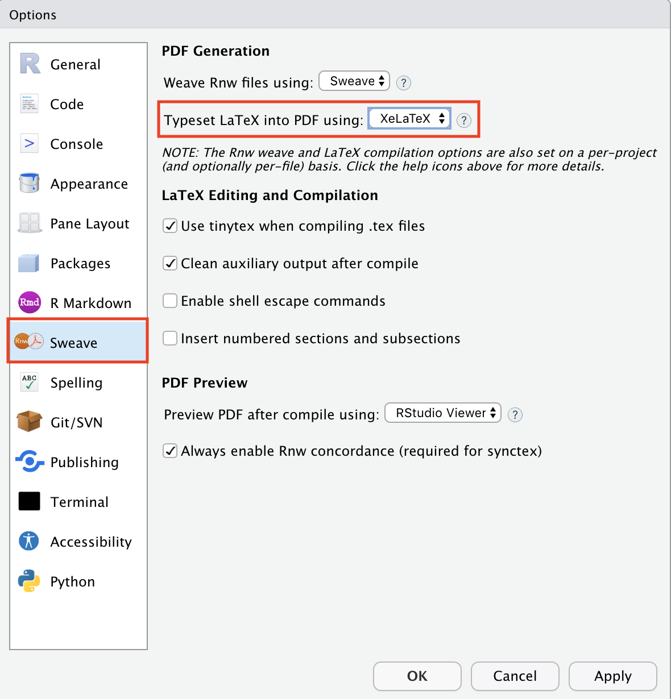

```{r setup, include=FALSE}
knitr::opts_chunk$set(echo = TRUE)
library(magrittr)
```

***

# Background

We saw [last time](lec_20_markdown_1.html) how to work with some of the basic formatting options when creating `.pdf` files in **R Markdown**. Here we will learn about some of the more advanced formatting options for creating nice looking documents. You should download the blank `.Rmd` template [here](lec_21_blank_template.Rmd), which contains some random text and other output options.

***

# Basic info

The basic information in the `YAML` of a blank `.Rmd` document set for `.pdf` output includes the following

```{r yaml, eval = FALSE}
title: "A catchy title"
author: "First Last"
date: "19 February 2021"
output: pdf_document
```

You can also add a subtitle with the `subtitle` argument and set the data to automatically update with the inline **R** code `r Sys.Date()`. You can create a custom format for the date as well. For example, the following `date` option will print as `day full_month_name four_digit_year`. Check out the options for `format()` to see how to change the date format.

```{r yaml_2, eval = FALSE}
title: "A catchy title"
subtitle: "A pithy subtitle"
author: "First Last"
date: "`r format(Sys.time(), '%d %B %Y')`"
output: pdf_document
```


***

# Document layout

The default document layout for `.pdf` files in **R Markdown** is pretty good, but there are some options to improve it. These options are specified primarily in the document's `YAML`, but some of them will be placed in the "chunk options" within **R** code blocks.

## Appearance

We can change the overall appearance or *class* of the document with the `documentclass` argument, which you set in the `YAML`. Here are some of the options.

### Article

The `article` class is a basic layout that has relatively large margins.

```{r article, eval = FALSE}
title: "Example template for exploring formatting options"
author: "First Last"
date: "2/19/2021"
output: pdf_document
documentclass: article
```

### Report

The `report`` class will create a separate title page and insert page breaks between level-one section headings. It also has relatively large margins.

```{r report, eval = FALSE}
title: "Example template for exploring formatting options"
author: "First Last"
date: "2/19/2021"
output: pdf_document
documentclass: report
```

### Two columns

You can create a document with two columns of text with the `classoption` argument. For example, here is an article with two columns.

```{r twocolumn, eval = FALSE}
title: "Example template for exploring formatting options"
author: "First Last"
date: "2/19/2021"
output: pdf_document
documentclass: report
classoption: twocolumn
```


## Margins

You can set the margin spacing to be the same for all four sides, or set each of them separately, with the `geometry` argument. Here is an example of setting all of the margins in an `article` to 1.5 inches. (Note that you can also use metric units for margins.)

```{r margins_1, eval = FALSE}
title: "Example template for exploring formatting options"
author: "First Last"
date: "2/19/2021"
output: pdf_document
documentclass: article
geometry: margin=1.5in
```

Here's an example of setting the top and bottom margins in an `article` to 1 inch and the left and right margins to 1.25 inches. Notice that when using multiple settings in an arguments, we need to set them on separate lines preceded by a dash `-`.

```{r margins_2, eval = FALSE}
title: "Example template for exploring formatting options"
author: "First Last"
date: "2/19/2021"
output: pdf_document
documentclass: article
geometry:
- top=1in
- bottom=1in
- left=1.25in
- right=1.25in
```

## Line spacing

You can increase the line spacing with the `linestretch` argument. For example, here is an `article` with 1-inch margins and double line spacing.

```{r line_spacing, eval = FALSE}
title: "Example template for exploring formatting options"
author: "First Last"
date: "2/19/2021"
output: pdf_document
documentclass: article
geometry: margin=1in
linestretch: 2
```

## Line numbers

You can add line numbers to `.pdf` documents, but it involves using an additional **LaTeX** package call `lineno`. To use additional **LaTeX** packages, you have to use the `header-includes` argument in the `YAML`. Specifically, it looks like this for a double-spaced `article` with 1-inch margins:

```{r line_numbers, eval = FALSE}
title: "Example template for exploring formatting options"
author: "First Last"
date: "2/19/2021"
output: pdf_document
documentclass: article
geometry: margin=1in
linestretch: 2
header-includes:
  - \usepackage{lineno}
  - \linenumbers
```


## Fonts

### Size

You can set the font size in your document with the `fontsize` argument. For example, here is a double-spaced `article` with 1-inch margins and 12-point font.

```{r font_size, eval = FALSE}
title: "Example template for exploring formatting options"
author: "First Last"
date: "2/19/2021"
output: pdf_document
documentclass: article
geometry: margin=1in
linestretch: 2
fontsize: 12pt
```

### Family

You can change the font family, but doing so depends on the **LaTeX** engine you are using. You can check this by examining the **Global options** in **RStudio**. To do so, from the main menu options click on `Tools > Global Opotions...` In the dialogue box, select the `Sweave` option on the left and look at the `Typeset LaTeX into PDF using:` setting.



If you are using `pdflatex`, you can use the `fontfamily` argument to select a **LaTeX** font package to be loaded in your document to change the font. Also note that this requires you to use multi-line option specification for `output` like we saw for `geometry` above.

```{r font_fam_1, eval = FALSE}
title: "Example template for exploring formatting options"
author: "First Last"
date: "2/19/2021"
output:
  pdf_document: 
    latex_engine: pdflatex
fontfamily: Arial
documentclass: article
geometry: margin=1in
linestretch: 2
fontsize: 12pt
```

Then the document will use the Arial font. You may see https://tug.org/FontCatalogue/ for a list of many other **LaTeX** font packages. If your **LaTeX** distribution is **TinyTeX** and the required font packages have not been installed, they should be automatically installed when the document is compiled.

If you use the **LaTeX** engine **xelatex** or **lualatex**, you will be able to select fonts that are available on your local computer, and do not have to install additional LaTeX packages. To do so, use the `mainfont` argument like this:

```{r font_fam_2, eval = FALSE}
title: "Example template for exploring formatting options"
author: "First Last"
date: "2/19/2021"
output:
  pdf_document: 
    latex_engine: xelatex
mainfont: Arial
documentclass: article
geometry: margin=1in
linestretch: 2
fontsize: 12pt
```


***

# Front matter

You can add so-call *front matter* to your document, such as a table of contents.

## Table of contents

To automatically create a table of contents, set the `toc` argument to `true`. You can control how many heading levels you want to display in the table of contents with the `toc-depth` argument. For example, here is a double-spaced `report` with 1-inch margins, 12-point foint, and a table of contents that shows the first two heading levels.

```{r toc, eval = FALSE}
title: "Example template for exploring formatting options"
author: "First Last"
date: "2/19/2021"
output: pdf_document
documentclass: report
geometry: margin=1in
linestretch: 2
fontsize: 12pt
toc: TRUE
toc-depth: 2
```

## Document version

For some documents, I prefer to set a custom *version* number based on the date rather than set the `date` argument explicitly. To do so, simply include a line in the *main document* similar to something like this:

```{r version, eval = FALSE}
This is version `r paste0('0.',format(Sys.time(), '%y.%m.%d'))`.
```

that will render to

"This is version `r paste0('0.',format(Sys.time(), '%y.%m.%d'))`."

***

# Figure layouts


***

# Headers & footers


