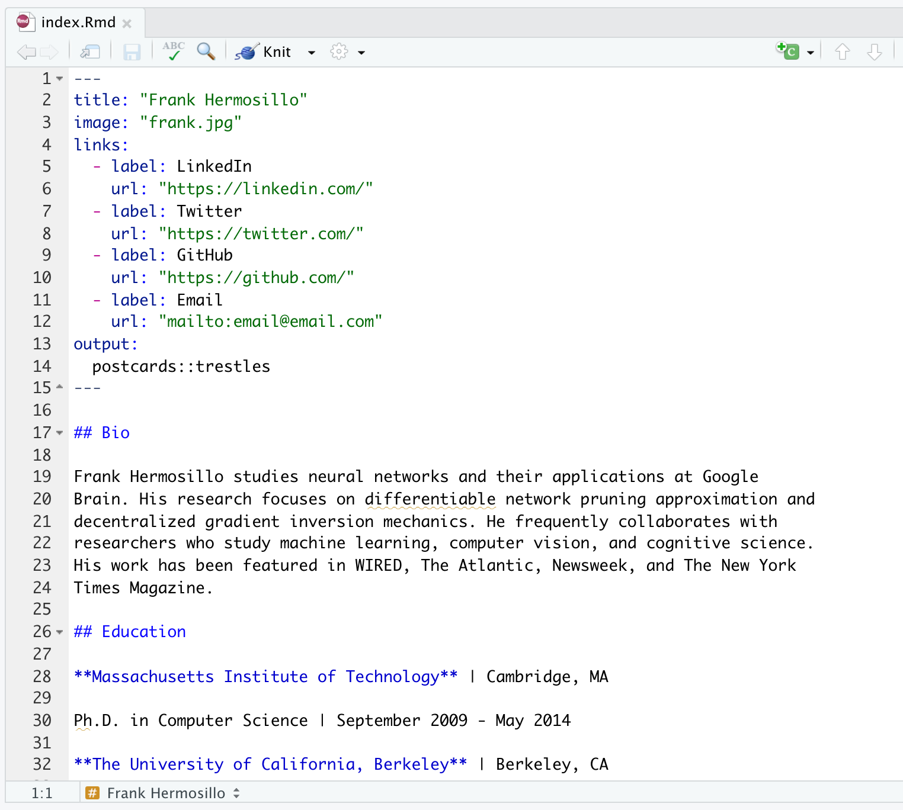

```{r set_defaults, include=FALSE}
knitr::opts_chunk$set(echo = TRUE)
```

***

# Background

One of the great features of **R Markdown** is using it to create static websites. These websites can be quite simple with only a single page or more complex with multiple pages and options, such as the website for this course. Websites created with **R Markdown** can be viewed/hosted directly on **GitHub** or [**Netlify**](https://www.netlify.com/), or copied over to a server such as http://students.washington.edu.

***

# Setup

For this exercise, we'll create a simple personal website and host it on **GitHub**. Although you can disply a static website from any **GitHub** repo, we'll use special repo with the same name as your **GitHub** username.

## Create a repo

Create a new repo on GitHub called `your_user_name` where `your_user_name` is your actual GitHub username. As soon as you've typed your full username into the `Repository name` box, GitHub should respond with a message in a green box below it about you having just found a secret and that this is a special repo (see image below).

In the **Description** box, type (or copy/paste) "This is the development repo for my personal website".

Make the repo **Public**.

Despite GitHub's urging, **DO NOT** add a README, .gitignore or license file.

Click the green **Create repository** button when you're finished.

```{r gh_create_repo, echo = FALSE, out.width = "90%", fig.align = "center"}

```

<br>

## Create RStudio project

The next step is to create a new project in **RStudio**. However, rather than base this new project on an existing repo, as we've done in the past, we'll instead choose **New Directory**.

```{r rs_new_proj, echo = FALSE, out.width = "70%", fig.align = "center"}

```

<br>

Scroll down the options for **Project Type** and select `Postcards Website`.

```{r rs_postcards, echo = FALSE, out.width = "70%", fig.align = "center"}
knitr::include_graphics("img/rs_postcards.png")
```

<br>

In the next **Create Postcards Website** window, enter your own **GitHub** username in the field for `Directory name:`

Choose the location where you'd like this new project to live.

Select the `Trestles` template from the drop-down menu.

When you are finished, check the box next to `Open in new session` and click the **Create Project** button.

```{r rs_postcards_details, echo = FALSE, out.width = "70%", fig.align = "center"}

```

<br>

# Postcards website

You now have a very simply **RStudio** project with 3 files:

1) `index.Rmd`

2) `frank.jpg`

3) `YOUR_USERNAME.Rproj` (where `YOUR_USERNAME` is your **GitHub** username)

## Content

The `index.Rmd` file contains the information to be displayed on your website. When first created, it should look like this:

```{r postcards_index_blank, echo = FALSE, out.width = "100%", fig.align = "center"}

```

<br>

The top section is a standard YAML that contains 4 fields:

1) `title`

2) `image`

3) `links`

4) `output`

### Title

The `title` field in `index.Rmd` is the title of your website that will be displayed at the top. Go ahead and change this from `Frank Mermosillo` to something relative to you. For example, your first and last names would be good options.

### Image

The `image` field in `index.Rmd` shows the name of the picture that will be displayed on your website. At present, it's set to `frank.jpg`, so you should change this to be the name of a picture/photo you'd rather have displayed. A headshot is always a great choice, but you could use an avatar or any other image you'd like.

**Note**: whatever name/file you choose, you'll need to move or copy that image file to the folder/directory where this project lives.

### Links

The next block that begins with `links` contains a list of `label/url` pairs. These will be buttons on your website that someone could click to direct them to other information about you elsewhere. The last `label/url` pair is for your email address. Not all of these `label/url` pairs are necessary, so you can delete any of them if you'd like. You can also add more of them if you'd like evern more options for others. Go ahead and edit/delete/add any options you'd like here.

When you are finished, your YAML section should resemble something like this:

```{r postcards_yaml, echo = FALSE, out.width = "100%", fig.align = "center"}

```

<br>

*** 

# Build the site

Let's go ahead and preview our website, which simply requires you to press the `Knit` button in the editor pane. When you do, **RStudio** will open a preview of your website in a new viewer window that should look something like this:

```{r postcards_preview, echo = FALSE, out.width = "100%", fig.align = "center"}

```

<br>

From here on, anytime you make a change to the content in `index.Rmd` you can just click the `Knit` button to instantly generate a preview.

***

# Personal details

Now it's time to edit `index.Rmd` so it contains information about you instead of Frank. At present there are headings and content for these sections:

* **Bio**

* **Education**

* **Experience**

You can edit any of these heading names and corresponding content to meet your personal preferences. Because this information is all written with standard **Markdown**, you can take advantage of any of the additional formatting options.

For example, the university and company names in the example template are enclosed with double-asterisks (`**`) so that they render in **bold** type. You could add an (un)ordered list, different heading levels, links to other URLs, equations, or additional images.

Here is an example of what your website could look like after you've edited the sections and content.

```{r postcards_final, echo = FALSE, out.width = "100%", fig.align = "center"}

```

<br>


